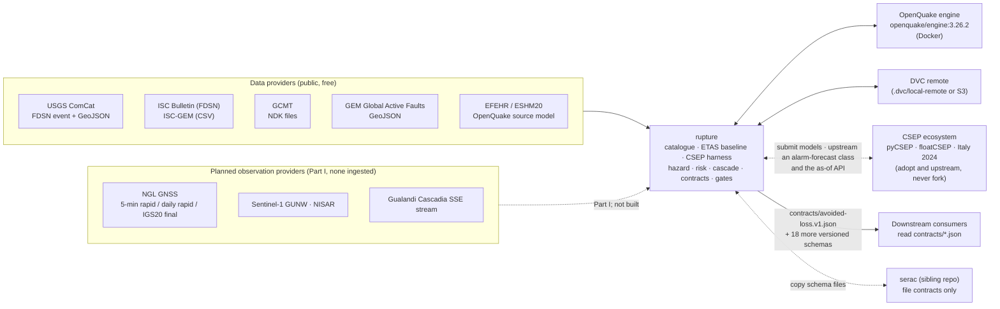
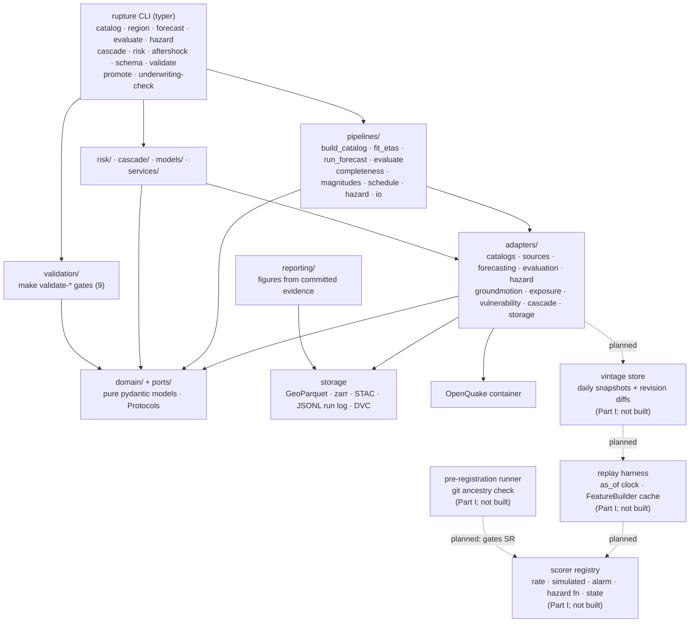

# Architecture

This document describes two things and keeps them clearly apart.

**Part I (§ 1–§ 6) is a design.** It is the port set Rupture is moving to now that the project's
target is prediction: latency-aware observation sources, a feature layer, a model that issues a
*hypothesis* rather than always a rate grid, and one scorer per hypothesis arm. **None of it is
built.** No module named in Part I exists in `src/` today. Every Protocol in it is a signature
proposed for review, not a signature you can import.

**Part II (§ 7–§ 10) describes the system that exists**, built over two earlier phases: the
catalogue infrastructure, the ETAS baseline, the CSEP harness, the hazard, loss and cascade lanes,
the gates and the deployment unit. That system keeps running. The re-architecture generalises the
ports around it and retires nothing.

Current as of 2026-09-04. Where this document and the tree disagree, the tree is right:
`src/rupture/validation/registry.py` is the authority on gates (its `GATES` tuple currently holds
**nine** — `schema`, `catalog`, `etas`, `eval`, `hazard`, `cascade`, `risk`, `aftershock`,
`challengers`; the `language` gate was removed with the banned-word rule on 2026-09-04, and any
document still saying "ten" is stale), `src/rupture/cli.py` on CLI nouns, `ls contracts/` on the
published contract surface, and `RELEASE_STATUS.md` on what has actually run.

Decisions are recorded in `docs/adr/`. Most of Part I now has one: ADR-0054 (latency-aware
observation sources), ADR-0055 (the hypothesis sum type and the scorer registry), ADR-0056
(pre-registration by git ancestry), ADR-0059 (the reference baseline set) and ADR-0060
(completeness as a field). **An accepted ADR is a decision, not an implementation** — none of that
code exists, and § 11 lists the pieces of Part I that no ADR yet covers.

---

# Part I — the re-architecture

## 1. Why the current spine cannot carry a prediction programme

The spine built in Prompts 1 and 2 is the CSEP shape, and it is faithfully implemented:

```
CatalogSource.fetch(region, start, end)          -> Catalog
ForecastModel.fit(catalog, region, cutoff)       -> FitResult
ForecastModel.forecast(history, issue_time, h)   -> ForecastGrid
Evaluator.evaluate(grid, target, tests)          -> list[EvaluationResult]
```

Those four signatures are in `src/rupture/ports/{catalog_source,forecast_model,evaluator}.py` and
you should read them before reading the rest of this section. They are good at what they were for.
They fail as a prediction spine in four ways. The architect's pre-review thesis named three; the
review named the fourth and it is the one with the most leverage.

### 1.1 Input poverty — the catalogue has already thrown the signal away

`fit(catalog, region, cutoff)` means a model can see a catalogue and nothing else. A catalogue is a
derived product: it is what survives after detection, association, location, magnitude assignment
and review have integrated away the continuous record. The review's verdict on where the surviving
evidence lives is unambiguous, and it is the single most consequential finding in it: the observables
with the strongest evidence are all *below* the catalogue.

The specific results, with their numbers and their scope conditions:

- In a sheared laboratory fault, the continuous low-amplitude acoustic emission reads instantaneous
  frictional state. Rouet-Leduc et al. (GRL 2017) report a random forest on ~100 window statistics
  predicting time-to-failure at R² = 0.89, against R² = 0.3 for a periodicity baseline, from any
  point in the cycle and with no history. At metre scale, Norisugi, Kaneko & Rouet-Leduc (Nature
  Communications 2025; NIED experiment LB12-011, 1.5 m fault, 34 events, 19 train / 4 validation /
  11 test) report time-to-failure R²(log) = 0.84 and nominal shear stress R² = 0.81, against an
  inter-event-time baseline at R² = −0.28 — a baseline that is *worse than the mean*, which is the
  honest way to report it. Status per `docs/RESEARCH_LANDSCAPE.md` § 3.9, which is the register:
  Rouet-Leduc et al. (2017) is `replicated`, independently reproduced by van Klaveren, Vasconcelos
  & Niemeijer (2020, arXiv:2011.06669) on glass beads and salt gouge; Norisugi et al. (2025) is
  `single-study`. The Norisugi paper is CC BY-NC-ND 4.0; its Zenodo data is CC-BY-4.0.
- The Earth transfer works only where a natural fault broadcasts a slip-modulated continuous signal.
  Cascadia tremor power tracks GPS slip rate at Pearson CC 0.4–0.6 depending on window
  (Rouet-Leduc et al. 2019); 8–13 Hz energy builds ~100 days before slow-slip events (Hulbert et al.
  2020, CC ≈ 0.56, and the 2018 event was missed). **Critically for this argument: that build-up is
  below the tremor-catalogue threshold.** A model reading catalogued tremor cannot see it.
- On a locked fault, every attempt has failed. Johnson, Wang & Johnson (2025) nowcast contemporaneous
  Kilauea displacement at R² = 0.63 with wav2vec-2.0 and identify future slip onset for 3 of 20
  events. That is the decisive precedent and it is negative in a specific, useful direction: the
  model reads present state, not future state.

None of those observables is expressible through `fit(Catalog, ...)`. This is not a modelling
deficiency that a better model inside a `ForecastModel` could overcome; the port never passes the
information in, so no amount of skill downstream can recover it.

**The qualification that matters, and it is a large one.** "Get below the catalogue" is not the same
claim as "denser catalogues are better", and the review is emphatic that the second claim is false.
Mancini et al. (2022) fed four Central Italy catalogues, from Mc 2.3 down to Mc 0.2, into ETAS and
Coulomb rate-and-state models and found **no significant M3+ information gain and information
*loss* at M1–M2**. Density without a completeness model, adequate spatial discretisation and uniform
magnitudes is not information. This is why `CompletenessField` in § 2 is a *mandatory* companion to
every catalogue-derived observation rather than an optional extra, and why the port set below types
completeness rather than assuming it.

### 1.2 Output poverty — one output type means one kind of claim

`ForecastGrid` is expected counts per cell, per magnitude bin, over a window. Several of the claims a
prediction programme must be able to state and score are not that object:

- an **alarm** — a region, a window, and a declaration, with a declared alarm fraction;
- a **hazard function** — instantaneous rate as a continuous function of time from now, which is what
  a lead-time curve is actually made of;
- a **state estimate** — this patch is at such-and-such shear stress or slip rate, with uncertainty.
  This is the quantity the lab literature actually identified as predictable (Norisugi et al. 2024/2025:
  shear stress on velocity-strengthening creeping patches), and it exists in nature.

CSEP's consistency tests score the rate-grid form and its simulated-catalogue analogue. They were
not built to adjudicate alarm-based or precursor claims, and pyCSEP has no alarm-forecast class at
all. The adjudication machinery for alarms exists and is mature — Molchan diagram and area skill
score (Zechar & Jordan 2008), conditional nulls (Luen & Stark 2008) — but it lives outside the
software the field runs. So the scoring gap is an architecture gap: a project that can only
represent rate grids can only ever make CSEP-shaped claims, and it cannot referee anybody else's.

The review sharpens this in a way the thesis did not. The binding requirement on alarm scoring is
not merely *having* Molchan and area skill score; it is the **reference model**. Zhang, Zhan, Huang
& Sornette (JGR Solid Earth 2024, 129(3), 2023JB028037) show an LSTM predicting M ≥ 5 in mainland
China looks skilful on a Molchan diagram against a spatially uniform Poisson reference and loses the
skill entirely against a seismically informed, spatially varying Poisson reference. Luen & Stark
show a trivial rule — after any M ≥ 5.5, predict another within 21 days and 50 km — reaches p < 0.001
on the Harvard CMT catalogue purely from clustering. An alarm scorer that does not carry its
clustering-aware reference is a skill generator, not a scorer. That is why `Scorer` in § 2 declares
`required_baselines` and the harness refuses to emit a score without them.

### 1.3 Time granularity — necessary, and not free

Windows are fixed at 30 days with parameters frozen inside them (`docs/EVALUATION_PROTOCOL.md` § 3,
§ 6). Prediction is about lead time, and the interesting object is the skill-versus-lead-time curve
from an hour to a year and where it reaches zero. That needs continuous re-issuance rather than
window quantisation. The thesis is right about this.

**But here the review contradicts the thesis's implicit economics, and the contradiction is
load-bearing.** Continuous re-issuance is not a free improvement, for two reasons the thesis does not
mention:

1. **Scoring overlapping windows is an unsolved methodological problem.** The floatCSEP authors
   (Iturrieta et al., JOSS 2026) explicitly flag evaluation of overlapping-window operational forecast
   collections as open, and Spassiani et al. (2023) had to approximate it with a revised N-test when
   evaluating the OEF-Italy stream. Issuing daily 30-day forecasts produces exactly this object.
   Rupture may not quietly average dependent windows and call it a schedule.
2. **Fine granularity buys untestable claims unless power travels with it.** Khawaja et al. (2023)
   show the S-test cannot reject a uniform global forecast on a 0.1° grid without ~32,000 M ≥ 5.95
   events, roughly 300 years, while a data-driven quadtree restores discrimination at ~8 events. And
   Gualandi et al. (2020) bound Cascadia slow slip as low-dimensional chaos (correlation dimension
   < 5) with a **2–65 day predictability horizon by segment**. A one-hour-resolution lead-time curve
   extending past a segment's estimated horizon is not a finer measurement, it is a longer
   extrapolation.

So the design keeps continuous re-issuance and adds two obligations to it: every score reports its
statistical power, and every lead-time claim reports the estimated predictability horizon it sits
inside. Both are fields on `Score` in § 2. Solving dependent-window scoring is named as an open
question in § 6.4 rather than assumed away.

### 1.4 Vintage poverty — the leakage class the current controls cannot express

This is the review's own addition and it is where the most value is. Every leakage control in this
repository compares `origin_time` against a cut. Read
`src/rupture/adapters/forecasting/leakage.py`: `assert_all_before` compares `origin_time` to a
cutoff, `assert_within_window` compares `origin_time` to a window, `assert_issue_after_fit` compares
two cut times. `Catalog.before(cutoff)` filters on `origin_time`. These are correct and they are
insufficient, because **timestamp honesty is not the same as leakage honesty**. An observation's
*value* at time *t* may not have existed at time *t*.

Three sub-classes, each with a documented instance:

1. **Revision leakage.** Catalogue magnitudes, locations and event types are revised for months, and
   events are added and *deleted*. Girona & Drymoni's (Nature Communications 2024) Anchorage
   detection of abnormal low-magnitude precursory seismicity depends on USGS events later removed and
   vanishes on the current catalogue. Two honesty notes travel with that example: the rebuttal exists
   as Bradley & Hubbard's Earthquake Insights analysis, which carries a DOI but is **not
   peer-reviewed**, and no formal Matters Arising has been confirmed. It is the clearest worked
   example of the failure mode available, and it is not a settled retraction.
2. **Availability lag.** The Nevada Geodetic Laboratory serves IGS20 daily *final* solutions at about
   two weeks' latency, daily *rapid* at ~24 h, and 5-minute rapid at ~24 h — and the final solution
   is the more accurate one. A model evaluated at "one-hour lead time" on final-orbit GNSS is reading
   a product that did not exist for a fortnight.
3. **Completeness-regime mismatch.** The real-time catalogue in the hours after a mainshock is a
   different object from the archive. Hainzl, Kumazawa & Ogata (GJI 2024) fit short-term aftershock
   incompleteness on the 2023 Türkiye sequence with a blind time of ~162 s, and their
   incompleteness-aware ETASI gains IGPEc 0.18 over standard ETAS. Li & Luo (2024) show MLE,
   b-positive and KMS b-value estimators all fail under realistic real-time incompleteness and
   magnitude error — which is precisely why the Gulia–Wiemer traffic-light dispute cannot be settled
   on archival catalogues.

The field admits this obliquely and proceeds anyway. Rhoades et al. (2018) state that the New Zealand
CSEP testing centre "did not consistently capture the real-time catalog so most results are
reprocessed" — the field's flagship decade-long prospective experiment, evaluated on revised data.
Mizrahi et al. (2024) note catalogue-based tests have not yet been used in a truly prospective
experiment.

Rupture is halfway here already and it is worth being precise about which half.
`docs/EVALUATION_PROTOCOL.md` § 9 freezes the **target** slice at evaluation time, storing
`target_catalog_hash` on every `EvaluationResult` and archiving the slice, so a re-evaluation against
a revised catalogue produces a *new* result rather than silently overwriting the old one. That is
good practice and it is the *output* side. Nothing in the tree does the equivalent on the **input**
side: a fit at cutoff *T* reads today's catalogue filtered to `origin_time < T`, which is the
best-available record of the past rather than the record that existed at *T*. And
`Provenance.retrieved_at` is not a substitute — it records when *rupture* fetched a payload, not when
the upstream provider first made that value available. The gap is real, it is named in § 6.2, and
closing it is what `available_as_of(t)` is for.

The direction of the bias is the reason this matters more than its subtlety suggests. Revised
catalogues, final orbits and reprocessed products are all *cleaner* than what was available at issue
time, and cleaner inputs flatter the model. This repository already holds evidence for how large
"flattering" can be: the deliberately leaky ablation in `reports/CHALLENGER_EVALUATION.md`
manufactures **+0.31 to +2.16 nats per event** of apparent skill, and turns a **−0.346** information
gain *loss* on Nepal into a **+0.429** apparent win — a 181 % swing that changes the sign. Those are
timestamp leaks, which the current controls do catch. Latency leaks run in the same direction and no
current control fires on them.

**State of this claim: hypothesis, untested.** Nobody has measured the size of the latency effect,
including us. The review's opening #1 states the hypothesis as "at least one published result will
lose significance when replayed on the data that was actually available" and gives it a failure
criterion: if the as-of-minus-final delta is within bootstrap noise for every model and sequence
tested, latency is not a practical leakage class and the layer is demoted from an evaluation
requirement to a data-engineering convenience. That failure criterion is part of the design and § 3.5
says how it would be measured.

### 1.5 What the review contradicts in the thesis

Recorded explicitly, because the thesis was a strong prior and the review wins where they disagree.

| Thesis position | Review's position | Effect on this design |
|---|---|---|
| Input poverty is the first problem | Agrees, and calls the catalogue-shaped port the *binding* constraint on the whole project, above modelling | Strengthened, not weakened. § 1.1 |
| Below-catalogue observables carry the signal | Agrees on the architecture, but denser catalogues alone gave **no M3+ gain and information loss at M1–M2** (Mancini et al. 2022) | `CompletenessField` is mandatory, not optional. § 2.2 |
| Output poverty: alarms need Molchan / area skill / ROC | Agrees, and adds that the **reference model** is the binding requirement, not the diagram (Zhang et al. 2024; Luen & Stark 2008) | `Scorer.required_baselines` and a harness that refuses a score without them. § 4 |
| Continuous re-issuance is the fix for time granularity | Necessary, but overlapping-window scoring is an **open methodological problem** (floatCSEP authors), and lead-time claims are bounded by an estimated predictability horizon (Gualandi et al. 2020: 2–65 days by Cascadia segment) | Kept, with power and horizon as mandatory fields on `Score`; dependent-window scoring listed as an open question. § 1.3, § 6.4 |
| Build a continuously-running open prospective benchmark as the contributor magnet | **Do not build a parallel benchmark** *of the arms CSEP already scores.* pyCSEP, floatCSEP, EarthquakeNPP and the CSEP California archive exist and are permissively licensed; extending them buys the adjudication Rupture needs, forking them buys isolation | Split, not rejected. The rate-grid and simulated-catalogue arms go to floatCSEP and the CSEP Italy 2024 experiment, and the alarm-forecast class is written to be upstreamed to pyCSEP (ADR-0061). A Rupture-operated forward-in-real-time board is kept for the arms no testing centre scores — alarms, hazard functions, state estimates — with a twelve-month failure criterion (ADR-0057). § 4.4 |
| Bletery & Nocquet's precursory geodetic slip motivates the geodetic ports | The claim is **leaning negative**: the authors concede common-mode filtering removes it; injection tests show that filter preserves 80–95 % of synthetic tectonic signal; three events dominate the stack; an independent tiltmeter stack bounds Tohoku preslip below 5 × 10¹⁸ N m (~Mw 6.4) (Hirose, Kato & Kimura, GRL 2024 — the peer-reviewed piece of that record) | The geodetic ports are justified by *expressibility and adjudication*, not by asserting the signal is real. Rupture's interest in Bletery & Nocquet is as an arbiter. § 4.3 |
| Precursor literature motivates non-seismic observation sources | Mostly rebutted, and one citation in the source material is **inverted**: Warden et al. (2020) is tagged `replicated` and is a **failed replication** that finds no significant precursory ULF activity for 2013–2018 and urges caution about EM precursor research | No ULF ingestion path is designed. Non-seismic claims enter as *submitted alarm functions to be scored*, never as Rupture-generated hypotheses. § 4.2 |

## 2. The new port set

Four ports and the domain types they need. All of this is proposed; none of it exists. The layout
rules do not change: `domain/` imports nothing outward, `ports/` imports only `domain`, `adapters/`
implement ports, all three enforced by import-linter (`pyproject.toml`, `make lint`).

### 2.1 The spine

```
ObservationSource[T].available_as_of(as_of, window)  -> ObservationSet[T]
FeatureBuilder.build(as_of, region, sources)         -> FeatureSet
PredictionModel.issue(as_of, horizon, region, ...)   -> Hypothesis
Scorer[H].score(hypothesis, outcome, baseline)       -> Score
```

Read it as: *what could have been known at this instant* → *what a model may compute from that* →
*what claim the model makes* → *how that class of claim is adjudicated*. The `as_of` instant is
threaded through all four and is the only clock in the system.

### 2.2 Domain types the ports need

New pydantic v2 models under `src/rupture/domain/`, all frozen, all `extra="forbid"`, all inheriting
`RuptureModel` as the existing models do.

```python
# domain/observation.py
from __future__ import annotations

from enum import StrEnum
from typing import Generic, TypeVar

from pydantic import Field

from rupture.domain.common import Provenance, RuptureModel, UTCDatetime

T = TypeVar("T")


class ObservableKind(StrEnum):
    """What an observation is of. Extended by adding a member, never by a free-text field."""

    CATALOGUE_EVENT = "catalogue_event"
    COMPLETENESS_FIELD = "completeness_field"
    GNSS_POSITION = "gnss_position"
    INSAR_DISPLACEMENT = "insar_displacement"
    CONTINUOUS_WAVEFORM = "continuous_waveform"
    DAS_STRAIN = "das_strain"
    TREMOR_RATE = "tremor_rate"
    TILT = "tilt"
    BOREHOLE_STRAIN = "borehole_strain"
    SLIP_INVERSION = "slip_inversion"


class Censoring(StrEnum):
    """Why a value is not a plain measurement. ``GAP`` is missing; the rest are censored.

    The distinction is load-bearing: DAS strain-rate saturates by optical cycle-skipping under
    strong motion (van den Ende et al. 2025, Seismica; a hard instrument limit, `single-study`),
    which is a right-censored observation and not a missing one. A model that treats the two
    alike will read the largest events as quiet.
    """

    NONE = "none"
    LEFT = "left"
    RIGHT = "right"
    SATURATED = "saturated"
    GAP = "gap"


class Vintage(RuptureModel):
    """The identity of one snapshot of one source. Two vintages of the same window differ."""

    source_id: str
    snapshot_time: UTCDatetime = Field(
        description="When this snapshot was taken from the provider (UTC)."
    )
    sha256: str = Field(description="Digest of the snapshot payload, hex.")
    observed: bool = Field(
        description=(
            "True when the snapshot was captured live at snapshot_time. False when it was "
            "reconstructed after the fact from a later vintage plus the source's latency model, "
            "in which case every result computed from it is labelled 'reconstructed vintage'."
        )
    )
    parent_sha256: str | None = Field(
        default=None, description="The prior vintage this one revises; None for the first."
    )


class Observation(RuptureModel, Generic[T]):
    """One measurement with both of its times. This pair is the whole point of the redesign.

    ``valid_time`` is when the thing happened or the measurement refers to.
    ``available_time`` is when *this value* first became obtainable from the provider.
    A replay at ``as_of`` may read an observation only when ``available_time < as_of`` --
    strictly, matching the half-open ``[from, to)`` convention everywhere else in this repository --
    which is stronger than ``valid_time < as_of`` and is the condition the current controls
    cannot express.
    """

    valid_time: UTCDatetime
    available_time: UTCDatetime
    value: T
    uncertainty: float | None = Field(default=None, ge=0.0)
    censoring: Censoring = Censoring.NONE
    detection_threshold: float | None = Field(
        default=None, description="Below this the source cannot see; None when not characterised."
    )
    vintage: Vintage
    provenance: Provenance


class ObservationSet(RuptureModel, Generic[T]):
    """A window of observations from one source at one vintage, with the replay cut recorded."""

    source_id: str
    kind: ObservableKind
    as_of: UTCDatetime = Field(description="The replay instant this set was served for.")
    window_start: UTCDatetime
    window_end: UTCDatetime
    observations: tuple[Observation[T], ...]
    vintage: Vintage
    max_available_time: UTCDatetime | None = Field(
        default=None, description="Largest available_time in the set; must be < as_of."
    )
    content_hash: str
```

Two things about `Observation` are deliberate and contestable, and would take an ADR each. First,
`available_time` is a property of the *value*, not of the record: a revised magnitude is a **new**
observation with a later `available_time`, not a mutation of the old one, so a replay at an earlier
instant still sees the earlier value. Second, `available_time` is required and has no default. A
source that cannot supply it must say so by refusing, not by guessing; § 3.3 says what a source with
no vintage history is permitted to do instead.

Completeness is typed rather than assumed, because Mancini et al. (2022) is the reason to be here at
all:

```python
# domain/completeness.py
class CompletenessField(RuptureModel):
    """Mc(x, t) with uncertainty, as a field rather than a scalar.

    Required alongside every catalogue-derived observation set. A scalar region Mc — what
    ``Region.mc`` holds today — is representable as a degenerate field with one cell and one
    epoch, and is labelled as such so nobody mistakes it for a fitted field.
    """

    region_id: str
    method: str = Field(description="Estimator identifier, e.g. 'maxc+0.2', 'lilliefors', 'field'.")
    epochs: tuple[UTCDatetime, ...]
    cell_ids: tuple[str, ...]
    mc: tuple[tuple[float, ...], ...] = Field(description="mc[epoch][cell].")
    mc_uncertainty: tuple[tuple[float, ...], ...] | None = None
    degenerate: bool = Field(
        description="True when this is a single scalar promoted to a field, not a fitted Mc(x, t)."
    )
    provenance: Provenance
```

### 2.3 `ObservationSource`

```python
# ports/observation_source.py
from __future__ import annotations

from collections.abc import Sequence
from datetime import datetime, timedelta
from typing import Protocol, TypeVar, runtime_checkable

from rupture.domain.observation import ObservableKind, ObservationSet, Vintage
from rupture.domain.region import Region

T_co = TypeVar("T_co", covariant=True)


@runtime_checkable
class ObservationSource(Protocol[T_co]):
    """A source of observations that can be replayed at an instant.

    The contract is ``available_as_of(t)``, **not** ``before(t)``. An implementation returns only
    observations whose ``available_time < t`` — half-open, matching every other window in this
    repository — and raises rather than silently filtering when it cannot honour that. A source
    that has no vintage history for the requested instant raises ``VintageUnavailable``; it never
    substitutes the current values, because substituting them is the leak.
    """

    source_id: str
    adapter_version: str
    kind: ObservableKind

    def latency_model(self) -> LatencyModel:
        """How this source's ``available_time`` relates to its ``valid_time``. See § 3.2."""
        ...

    def available_as_of(
        self,
        as_of: datetime,
        *,
        window: tuple[datetime, datetime],
        region: Region | None = None,
    ) -> ObservationSet[T_co]:
        """Observations with ``valid_time`` in ``window`` and ``available_time < as_of``."""
        ...

    def vintages(self, *, window: tuple[datetime, datetime]) -> Sequence[Vintage]:
        """Every snapshot this source holds overlapping ``window``, oldest first."""
        ...

    def revision_diff(self, earlier: Vintage, later: Vintage) -> RevisionDiff:
        """What changed between two vintages: added, deleted and amended records."""
        ...
```

The supporting types:

```python
# domain/latency.py
class RevisionPolicy(StrEnum):
    IMMUTABLE = "immutable"          # a value, once published, never changes
    SUPERSEDED = "superseded"        # a later product tier replaces this one wholesale
    AMENDED = "amended"              # individual records are edited in place upstream
    AMENDED_WITH_DELETION = "amended_with_deletion"   # records may also disappear


class ProductTier(RuptureModel):
    """One product of one source, e.g. NGL 'rapid daily' vs NGL 'IGS20 daily final'."""

    tier_id: str
    nominal_lag: timedelta = Field(description="Documented valid_time -> available_time lag.")
    measured_lag_p50: timedelta | None = None
    measured_lag_p95: timedelta | None = None
    revision_policy: RevisionPolicy
    settles_after: timedelta | None = Field(
        default=None, description="After this, values stop changing; None when they never do."
    )
    superseded_by: str | None = None
    evidence: str = Field(
        description=(
            "How the lag numbers were obtained. 'documented:<url>' when taken from the provider "
            "and never measured here; 'measured:<report>' when Rupture measured it against its "
            "own snapshot series. The two must not be confused in any published table."
        )
    )


class LatencyModel(RuptureModel):
    source_id: str
    tiers: tuple[ProductTier, ...]
    default_tier_id: str
```

### 2.4 `FeatureBuilder`

```python
# ports/feature_builder.py
@runtime_checkable
class FeatureBuilder(Protocol):
    """Turn replayed observations into model input. Strictly causal, cacheable, hashed.

    ``build`` is a pure function of ``(as_of, region, the observation sets it read)``, so its
    output is cacheable on ``feature_hash`` and a cache hit is a reproducibility check rather
    than only a speed-up. The builder never reads a source directly: it is handed
    ``ObservationSource`` instances and every read goes through ``available_as_of(as_of, ...)``.
    """

    builder_id: str
    builder_version: str
    requires: tuple[ObservableKind, ...]

    def build(
        self,
        as_of: datetime,
        *,
        region: Region,
        sources: Mapping[ObservableKind, ObservationSource[Any]],
        lookback: timedelta,
    ) -> FeatureSet: ...
```

```python
# domain/features.py
class FeatureSet(RuptureModel):
    builder_id: str
    builder_version: str
    region_id: str
    as_of: UTCDatetime
    lookback: timedelta
    names: tuple[str, ...]
    values: tuple[float, ...]
    missing: tuple[str, ...] = Field(
        default=(),
        description="Features the builder could not compute at this as_of, named rather than "
        "imputed. A model decides what to do with a gap; the builder never invents one.",
    )
    inputs: tuple[SourceRead, ...] = Field(
        description="One entry per source read: source_id, tier_id, vintage sha256, "
        "max_available_time. This is the audit trail the replay gate checks."
    )
    max_input_available_time: UTCDatetime
    feature_hash: str
```

The invariant `max_input_available_time < as_of` is checked on construction and again by the gate.
`missing` rather than imputation is the same rule as `Provenance` unknowns being `null`: a builder
that silently zero-fills an unavailable GNSS series has told the model that the ground did not move.

### 2.5 `PredictionModel`

```python
# ports/prediction_model.py
@runtime_checkable
class PredictionModel(Protocol):
    """Issue a hypothesis as of an instant, for a horizon.

    Replaces ``ForecastModel`` as the general case. An ETAS-style rate model is the special case
    where ``hypothesis_kind`` is ``RATE_FORECAST``; the existing ETAS adapter becomes one of
    these without changing its mathematics (§ 5).
    """

    model_id: str
    model_version: str
    hypothesis_kind: HypothesisKind
    consumes: tuple[ObservableKind, ...]

    def fit(
        self,
        *,
        region: Region,
        train_end: datetime,
        builder: FeatureBuilder,
        sources: Mapping[ObservableKind, ObservationSource[Any]],
    ) -> FitResult:
        """Fit on features built at instants strictly before ``train_end``.

        Every ``as_of`` used in fitting satisfies ``as_of <= train_end``, and every observation
        reaching those features satisfies ``available_time < as_of``. Both are asserted, and both
        have a negative twin test that injects a violation and expects an error.
        """
        ...

    def issue(
        self,
        as_of: datetime,
        horizon: timedelta,
        *,
        region: Region,
        features: FeatureSet,
    ) -> Hypothesis:
        """Issue one hypothesis. ``features.as_of`` must equal ``as_of``."""
        ...

    def parameter_snapshot(self) -> dict[str, Any]:
        """Parameters the next ``issue`` would use; hashed onto every hypothesis."""
        ...
```

### 2.6 `Scorer`

```python
# ports/scorer.py
H_contra = TypeVar("H_contra", bound="Hypothesis", contravariant=True)


@runtime_checkable
class Scorer(Protocol[H_contra]):
    """Adjudicate one arm of the hypothesis sum type.

    One scorer per arm, registered in the scorer registry (§ 4.1). ``required_baselines`` names
    the reference models this scorer will not run without: the harness computes them on the same
    data and refuses to emit a ``Score`` if any is absent. Beating an unfitted or weak baseline is
    the commonest way a published result turns out to be nothing — Mignan & Broccardo (2019)
    matched the DeVries et al. (2018) deep network's AUC 0.849 with a two-parameter logistic
    regression at 0.85, and distance-plus-slip reached 0.86.
    """

    scorer_id: str
    scorer_version: str
    scores: HypothesisKind
    required_baselines: tuple[str, ...]

    def score(
        self,
        hypothesis: H_contra,
        outcome: Outcome,
        *,
        baselines: Mapping[str, H_contra],
        alpha: float = 0.05,
        n_simulations: int = 10_000,
        seed: int | None = None,
    ) -> Score: ...

    def power(
        self,
        hypothesis: H_contra,
        *,
        alternative: H_contra,
        outcome_geometry: OutcomeGeometry,
        alpha: float = 0.05,
        n_simulations: int = 10_000,
        seed: int | None = None,
    ) -> PowerEstimate:
        """The probability this test would detect ``alternative`` at this sample size.

        Not optional. Khawaja et al. (2023) showed the S-test cannot reject a uniform global
        forecast on a 0.1-degree grid without ~32,000 events (~300 years), while a data-driven
        quadtree needs ~8. A test result without its power can be silently meaningless.
        """
        ...

    def minimum_detectable_effect(
        self, *, outcome_geometry: OutcomeGeometry, alpha: float = 0.05, power: float = 0.8
    ) -> MinimumDetectableEffect:
        """What a null result from this scorer actually bounds.

        Every Rupture negative result reports this. The template is Hirose, Kato & Kimura (GRL
        2024): not "we saw no preslip before Tohoku" but "any preslip was below 5e18 N m,
        approximately Mw 6.4". A null without a bound is not a finding.
        """
        ...
```

## 3. Latency-aware replay

The claim carrying the most weight in this design: `available_as_of(t)` differs from `before(t)`,
and the difference is a leakage class the current controls cannot express (§ 1.4). This section is
how it would actually be built and tested, because a control that is only argued for is not a
control.

### 3.1 The mechanism

Three pieces.

**A vintage store.** Daily snapshots of each source, held as content-addressed payloads with a
manifest per `(source_id, snapshot_time)` recording the sha256, the parent snapshot and the
window covered. For catalogues this is small: the daily ComCat, SCEDC, INGV and GeoNet event
records for a region compress to something a DVC remote absorbs without discussion. Revision diffs
are derived, not stored — `revision_diff(earlier, later)` recomputes them from two payloads, so a
diff can never disagree with the snapshots it claims to describe.

**A replay clock.** A run declares one `as_of` and the harness constructs the source set bound to it.
Every read goes through `available_as_of(as_of, ...)`; there is no other accessor on the port.
The clock is what makes the leak structurally hard rather than merely forbidden: a model cannot
read the future because it holds no object that can return it.

**A refusal, not a filter.** When the store has no vintage covering `as_of`, the source raises
`VintageUnavailable`. It does not fall back to current values. This is the same rule as "adapters
fetch or fail loudly", applied on the time axis.

### 3.2 What each source's latency model looks like

Every figure below is **documented by the provider and reported in the review; none has been
measured by Rupture**. Under `ProductTier.evidence` they are all `documented:<url>` and every
published table must say so. Measuring the realised distribution against Rupture's own snapshot
series is work item one of § 3.5.

| Source | Product tier | Documented valid → available lag | Revision policy | Notes |
|---|---|---|---|---|
| ComCat / SCEDC / INGV / GeoNet events | automatic solution | seconds to minutes | `AMENDED_WITH_DELETION` | events are added, amended and deleted; Girona & Drymoni's detection depends on events later removed |
| the same | reviewed solution | hours to months | `AMENDED_WITH_DELETION` | never formally settles; `settles_after = None` |
| the same, first hours of a sequence | real-time | — | — | a different object, not a lagged one: ~162 s blind time on Türkiye 2023 (Hainzl et al. 2024). Modelled through `CompletenessField`, not through lag |
| NGL GNSS | 5-minute rapid | ~24 h | `SUPERSEDED` | the exact product behind Bletery & Nocquet |
| NGL GNSS | daily rapid | ~24 h | `SUPERSEDED` | superseded by final |
| NGL GNSS | IGS20 daily final | ~2 weeks | `SUPERSEDED` | the accurate one; reading it at 1-hour lead is the textbook latency leak |
| EarthScope / CWU L2 | daily | daily updates | `SUPERSEDED` | valuable as an **independent second processing**: a precursor that does not survive a processing change is not a precursor |
| ARIA-S1-GUNW / LiCSAR (Sentinel-1) | GUNW | 6-day repeat; LiCSAR products ~2 weeks after acquisition | `SUPERSEDED` | acquisition time, not event time, sets the floor |
| NISAR | provisional → validated | 12-day repeat; provisional products public 20 Jul 2026 for acquisitions from 17 Jun 2026; validated expected Q4 2026 after reprocessing | `SUPERSEDED` | a whole product-quality tier change; an experiment spanning it reads two different instruments |
| Gualandi Cascadia SSE inversion | daily | ~2 days | `AMENDED` | daily folders run 2024-07-08 to 2026-09-02; the inversion itself updates |
| DAS (Ridgecrest array into SCSN) | streamed | 0.6 s | `IMMUTABLE` | 100 Hz on 5,000 of 10,000 channels; the one source where latency is not the problem and saturation is |
| EarthScope S3 miniSEED subset | archive | ~2 days | `IMMUTABLE` | |

Reading across that table: the honest lead times available to a model differ by five orders of
magnitude between modalities, and a feature set that mixes DAS at 0.6 s with NGL final at two weeks
has an effective lead time set by its slowest input. `FeatureSet.max_input_available_time` makes that
visible instead of leaving it to be discovered by a reviewer.

### 3.3 The problem the store cannot solve, stated rather than smoothed

A vintage store built today can only snapshot forward. For any window before the store existed, the
vintage that was actually available is gone — nobody kept it, which is the whole reason this is an
open opportunity. Two responses, and the design takes both:

1. **Prospective windows are honest by construction.** Once the store runs, every `as_of` after its
   first snapshot is served from an `observed=True` vintage. This is why the store is the first thing
   to build: it starts accruing the only asset that cannot be back-filled.
2. **Retrospective windows are reconstructed and labelled.** A reconstructed vintage applies the
   source's latency model to a later snapshot — withholding values whose modelled `available_time`
   postdates `as_of` — and sets `observed=False`. This approximates availability lag and **cannot
   reconstruct revision content**: it can withhold a magnitude that had not been published, but it
   cannot recover the wrong magnitude that had been. Every score computed on a reconstructed vintage
   carries the flag through to `Score.vintage_quality`, and a published comparison never silently
   mixes the two.

That limitation is not a detail. It means the strongest form of the latency result — "this published
result loses significance when replayed" — is only fully available for sequences after the store
starts, and retrospective replays give a *bound* on the effect rather than the effect.

### 3.4 How it is tested

Following the existing convention in `tests/unit/models/gridded/test_leakage.py`, where the module
docstring states the rule that every test has a negative twin, "because a leakage guard that has
never been seen to fire is not a guard":

1. **The half-open invariant, on real timestamps.** For a real fixture pair of vintages, every
   observation returned by `available_as_of(as_of, ...)` has `available_time < as_of`. Negative twin:
   an observation with `available_time == as_of` must raise, not be quietly dropped.
2. **`valid_time < as_of` is not sufficient.** A fixture containing a real catalogue event whose
   origin precedes `as_of` but whose *reviewed magnitude* was published after it. The current
   `assert_all_before` passes on this fixture; `available_as_of` must exclude the revised value and
   serve the earlier one. This test is the entire argument of § 1.4 reduced to one assertion, and if
   it cannot be written from a real vintage pair then the claim is not yet demonstrated.
3. **Feature causality.** `FeatureSet.max_input_available_time < as_of` for every built feature set,
   with a negative twin injecting a source read that violates it.
4. **Revision diffs are non-empty on real data.** A committed pair of real catalogue snapshots must
   show additions, amendments *and* at least one deletion. If a real pair shows no deletions, the
   fixture is wrong or the claim about deletions is wrong; either way the test says which.
5. **Reconstructed vintages are labelled end to end.** A score computed from an `observed=False`
   vintage must carry `vintage_quality = "reconstructed"` all the way to the published record, and a
   test asserts the flag survives serialisation.
6. **A gate, `validate-replay`.** Registered the way every other gate is: a module
   `src/rupture/validation/replay.py` exposing `run(repo_root) -> GateResult`, its name added to the
   `GATES` tuple, an `mk/replay.mk` fragment containing `VALIDATE_GATES += validate-replay`, and a
   step in the CI offline job with its name in that job's `covered` set — the last of which is what
   stops a gate rotting quietly. Offline on committed fixtures, or `SKIPPED` with a printed reason.

### 3.5 How the claim gets settled

The measurement, in order:

1. Measure the realised lag distribution for each source against Rupture's own snapshot series and
   replace `documented:` evidence with `measured:` where it holds. Until then no table claims a
   measured lag.
2. Publish a **replay-delta report** per model: skill on final data minus skill on as-of data, with
   bootstrap confidence intervals, for the models already in this repository (ETAS and the three
   challengers) across the sequences already fixtured.
3. Extend to at least three previously published short-term models across at least two sequences.

The review's success criterion for opening #1 is that at least one result changes sign or loses 95 %
significance, and adoption of an as-of API by pyCSEP or a CSEP testing centre. Its failure criterion
is stated in § 1.4 and is part of the design: if every delta sits inside bootstrap noise, the layer is
demoted to a data-engineering convenience and this document is rewritten to say so. Publishing that
negative is a deliverable under principle 7, not a retreat.

## 4. The `Hypothesis` sum type and the scorer registry

### 4.1 The sum type

A discriminated union in `domain/hypothesis.py`, with a shared base carrying what makes any claim
adjudicable.

```python
class HypothesisKind(StrEnum):
    RATE_FORECAST = "rate_forecast"
    SIMULATED_CATALOGUES = "simulated_catalogues"
    ALARM_SET = "alarm_set"
    HAZARD_FUNCTION = "hazard_function"
    STATE_ESTIMATE = "state_estimate"


class HypothesisBase(RuptureModel):
    hypothesis_id: str
    model_id: str
    model_version: str
    region_id: str
    as_of: UTCDatetime
    horizon: timedelta
    magnitude_range: tuple[float, float | None]
    magnitude_scale: str = Field(description="Named scale and authoritative catalogue, per NEPEC.")
    feature_hash: str
    parameter_snapshot_hash: str
    preregistration_commit: str | None = Field(
        default=None, description="Git sha of the pre-registration; None only for exploratory runs, "
        "which are refused by the scorer (§ 5)."
    )
    vintage_manifest_hash: str
    vintage_quality: Literal["observed", "reconstructed"]
    research_use_only: Literal[True] = True


class RateForecast(HypothesisBase):
    kind: Literal[HypothesisKind.RATE_FORECAST]
    grid: ForecastGrid                      # the existing domain model, unchanged


class SimulatedCatalogues(HypothesisBase):
    kind: Literal[HypothesisKind.SIMULATED_CATALOGUES]
    n_catalogues: int = Field(ge=1)
    store_locator: str = Field(description="Where the simulated catalogues live; not inlined.")
    seed: int


class AlarmSet(HypothesisBase):
    kind: Literal[HypothesisKind.ALARM_SET]
    cell_ids: tuple[str, ...]
    alarm: tuple[bool, ...]
    alarm_fraction: float = Field(ge=0.0, le=1.0, description="Declared before the window opens.")
    alarm_function: tuple[float, ...] | None = Field(
        default=None, description="The continuous function the threshold was applied to, kept so a "
        "Molchan trajectory can be traced over all thresholds rather than one."
    )
    threshold: float | None = None


class HazardFunction(HypothesisBase):
    kind: Literal[HypothesisKind.HAZARD_FUNCTION]
    knot_times: tuple[UTCDatetime, ...]
    intensity: tuple[float, ...] = Field(description="Conditional intensity per unit time.")
    cell_ids: tuple[str, ...] | None = None


class StateEstimate(HypothesisBase):
    kind: Literal[HypothesisKind.STATE_ESTIMATE]
    quantity: StateQuantity          # SHEAR_STRESS_PROXY | SLIP_RATE | COUPLING | TIME_TO_FAILURE
    patch_ids: tuple[str, ...]
    mean: tuple[float, ...]
    sd: tuple[float, ...]
    units: str


Hypothesis = Annotated[
    RateForecast | SimulatedCatalogues | AlarmSet | HazardFunction | StateEstimate,
    Field(discriminator="kind"),
]
```

`research_use_only` is a `Literal[True]` rather than a settable flag, so it cannot be turned off by a
caller. This encodes the rule in CLAUDE.md that an operational claim is a different claim: a
research hypothesis leaking into an operational channel is a failure measured in lives, and NEPEC's
position is that public broadcasting of predictions before expert evaluation is strongly discouraged
and that USGS will not consider a method not first tested and vetted.

`magnitude_scale` and the closed `magnitude_range` are there because NEPEC's evaluability criteria
are the schema the institutions actually use: an unambiguous time window, a closed region, a
magnitude range with a named scale and authoritative catalogue, a stated probability, a declared
reference model, method frozen before testing, and all successes, false alarms and misses reported.
Writing them as required fields makes an unevaluable claim unrepresentable.

### 4.2 The scorer registry

A mapping from `HypothesisKind` to the scorers that may adjudicate it, each declaring the baselines
the harness must compute on the same data. A hypothesis with no registered scorer cannot be scored,
which is the intended behaviour: adding a claim type means also saying how it is refereed.

| Arm | Scoring rules | Mandatory baselines | State |
|---|---|---|---|
| `RateForecast` | pyCSEP N / M / S / L / CL, paired T- and W-tests on information gain per event, on quadtree grids where power demands it; **power reported with every test** | ETAS (`lmizrahi/etas`, MIT); **ETAS-I whenever the target catalogue goes below the routine Mc**; Helmstetter-style smoothed seismicity for time-independent claims | the tests exist today via `adapters/evaluation/pycsep.py`; power reporting, quadtree and the ETAS-I requirement are new |
| `SimulatedCatalogues` | catalogue-based, non-Poissonian number / spatial / magnitude / pseudo-likelihood / calibration tests (Savran et al. 2020) on ~10,000 simulated catalogues | ETAS simulated catalogues from the same fit | pyCSEP has these; Rupture does not call them |
| `AlarmSet` | **Molchan trajectory** (miss rate against alarmed space-time fraction), **area skill score** (1 perfect, 0.5 random), **ROC**, probability gain *G* reported with the alarm fraction it was achieved at, binomial significance | **an alarm-rate- and footprint-matched random alarm set**; a **spatially varying Poisson** reference; a clustering reference (ETAS-derived alarms) | no implementation anywhere in the field's open software; this is the gap |
| `HazardFunction` | continuous-time log-likelihood; proper scoring rules only — log and Brier with confidence intervals. The parimutuel gambling score is improper and is refused | ETAS conditional intensity over the same interval | new |
| `StateEstimate` | calibration against the later-observed outcome; reliability and PIT diagnostics; injection–recovery detectability curve giving minimum detectable effect against lead time | inter-event-time or periodic-recurrence baseline; a noise-only surrogate stack | new |

Four things about that table are not negotiable and each has a reason with a number behind it.

**ETAS-I, not ETAS, wherever small events are used.** The review's reading of the ML forecasting
record is that every apparent win concentrates in one regime — sub-completeness small events, where
plain ETAS degrades — and that no ML paper has compared against ETAS-I, the incompleteness-aware ETAS
that exists precisely for that regime (Mizrahi et al. 2021, MIT-licensed, since 2021). Stockman et
al. (2023, Earth's Future 11(9) e2023EF003777) beat ETAS specifically at input Mcut 1.2 on an
incomplete enhanced catalogue and **tie at M3+**; that scope condition is routinely dropped, and it
is the difference between "neural forecasting has overtaken ETAS" and "neural forecasting reaches
parity under specific data conditions". So a `RateForecast` scored on a catalogue below the routine
Mc without an ETAS-I baseline is refused by the harness rather than reported with a caveat.

**Alarm-rate-matched random baselines.** § 1.2 gives the evidence. The matched-random baseline is the
cheapest of the three required references and the hardest to argue with: it holds the alarm fraction
and the spatial footprint fixed and randomises only the placement, so a Molchan point above it is not
explained by "you alarmed a lot of space".

**Effect sizes worth powering for.** Nakatani's (2020) probability-gain review puts every
non-triggering phenomenon at *G* < 20 and mostly around 2, with p near 0.05, while foreshock and
aftershock clustering alone gives *G* in the hundreds to thousands. An alarm experiment that cannot
detect *G* = 2 has not tested the claim it thinks it tested, and `Scorer.minimum_detectable_effect`
is where that gets stated before results exist.

**Banned metrics, in CI rather than in prose.** Random splits of clustered catalogues, accuracy and
AUC on imbalanced grid cells, and RMSE or MAE on power-law targets are refused by the scorer
registry. Jover-Alfaro et al. (2026) replicated a 97.97 %-accuracy random forest and watched it fall
to 21–24 % under walk-forward validation against a 27.69 % baseline, and to 16 % cross-region. The
existing protocol already forbids k-fold (`docs/EVALUATION_PROTOCOL.md` § 7 rule 6); this generalises
that rule from the catalogue lane to every arm.

### 4.3 What the alarm arm is *for*

Not for Rupture to generate precursor claims. The review's reading of the precursor record is that it
is dense with specific rebuttals: Corralitos ULF was traced to a sensor fault; accelerating moment
release is a fitting artefact reproducible in synthetic catalogues (Hardebeck et al. 2008); VAN failed
the 1996 tests; Heki-type TEC enhancements occur at random comparably often (Ikuta et al. 2020);
Cullen et al. (2024) find **no significant, consistent global pre-earthquake ionospheric anomaly** —
a paper the source material tagged `replicated`, which inverts it; and Warden et al. (2020) is a
**failed replication** that finds no significant precursory ULF activity for 2013–2018 and explicitly
urges caution, tagged in the source material as a positive replication. The audit found no fabricated
papers and no dead DOIs across ~230 entries; what it found was status inflation and two sign
inversions. **When Rupture tags evidence anywhere in this repository, the vocabulary carries a
`negative-result` category**, whose absence is what produced both inversions.

The alarm arm exists so that claims from those communities can be *adjudicated* — a frozen alarm
function submitted from any data source, scored on a Molchan diagram against a clustering-aware
reference with its probability gain and its statistical power published. That is a service the field
has no open implementation of, and it is the role in which a project is trusted rather than
suspected. The same applies to the Bletery & Nocquet dispute: Rupture's interest is an
injection–recovery harness giving minimum detectable precursory moment against lead time and station
density, which outlives whichever way the verdict falls, and both sides' code and data are public
(Zenodo 8064086 — note the DataCite record carries both CC-BY-4.0 and an "Embargoed Access" flag, so
availability must be confirmed before scheduling work on it; `kyleedwardbradley/BN24` is CC0 and
unrestricted).

### 4.4 Interoperate, do not fork

The thesis proposed a Rupture-owned continuously-running benchmark. The review says plainly: do not
build a parallel benchmark. Those two positions were reconciled rather than one of them winning,
and the reconciliation is ADR-0057 plus ADR-0061, so state it here in full rather than quoting the
half that is easier to defend. **Rupture does not restate an arm CSEP already scores.** The
`RateForecast` and `SimulatedCatalogues` arms are packaged as floatCSEP containers and submitted to
the live CSEP Italy 2024 experiment, because third-party adjudication is the credential and a board
Rupture operates and scores is not third-party. **Rupture does operate a forward-in-real-time board
for the arms no testing centre scores** — `AlarmSet`, `HazardFunction`, `StateEstimate` — because
that is the only place a submitted precursor claim can be adjudicated at all, and ADR-0057 carries
that decision with a twelve-month failure criterion: no external submission and no external
adoption of the as-of API means the board is a private scoreboard and is folded into CSEP. None of
that machinery exists yet. The tools it would be built from do:
pyCSEP (BSD-3, now at `cseptesting/pycsep` after a repository transfer —
the old `SCECcode` path 301-redirects and breaks scripted resolution), floatCSEP (BSD-3, JOSS 2026),
EarthquakeNPP (MIT) and the CSEP California archive (56.4 GB, CC BY 4.0, Zenodo 15076187) all exist
and are permissively licensed. Extending them buys credibility with exactly the people whose
adjudication Rupture needs; forking them buys isolation. Concretely, the scorer registry is designed
so that:

- the `AlarmSet` scorer is written as a pyCSEP-shaped alarm-forecast class and offered upstream;
- every `PredictionModel` is packaged as a floatCSEP-compatible container, since a model tested by a
  third party such as CSEP is the one credential the 2024 Delphi elicitation of 20 experts found
  near-consensus on (74 % on third-party testing, 79 % on benchmark comparison; no individual CSEP
  test reached consensus as a strict gate at 42–45 %);
- the as-of API is the thing Rupture offers the field that nobody else has, and its success criterion
  is adoption by pyCSEP or a testing centre rather than usage inside this repository.

## 5. Pre-registration, mechanically enforced

Principle 4 says git is the timestamp. Making that mechanical rather than aspirational is a small
piece of machinery with a large effect.

A pre-registration is a committed file under `prereg/<experiment-id>.yaml` declaring, at minimum: the
hypothesis in one sentence; the hypothesis kind; region; magnitude range with its named scale and
authoritative catalogue; lead time and horizon; alarm rate where the kind is `ALARM_SET`; the scoring
rule; the baselines; the decision threshold; and — the field the literature almost never supplies —
the **failure criterion**, the result that would make the authors stop. Every model card states its
failure criterion before results exist.

The runner refuses to score unless the pre-registration commit is an ancestor of the commit that
introduced the test data:

```
git merge-base --is-ancestor <preregistration commit> <commit introducing the test-data vintage>
```

The right-hand anchor needs to be concrete or the check is theatre. It is **the commit that
introduced the DVC pointer for the vintage manifest covering the evaluation window** — not the data
payload, which lives on a remote and has no commit, and not the code, which changes for unrelated
reasons. `Hypothesis.vintage_manifest_hash` names that manifest, so a scored result carries the
pointer to the object whose ancestry was checked, and a third party can re-run the check from the
public history alone.

**What this proves and what it does not.** It proves ordering *within the repository*: the hypothesis
was committed before the test-data vintage entered it. It does not prove the author had never seen
the data — anyone can download a catalogue privately. For genuinely prospective windows, where
`as_of` is in the future at pre-registration time, the distinction collapses and the proof is
complete, which is the strongest argument for the prospective mode. For retrospective windows the
check is a real constraint that is not a proof, and it must be described that way rather than
oversold. That honesty is itself the point: the review's judgement is that a project trusted to
referee is worth more than a project trusted to model.

## 6. Migration

This is a generalisation. F0–F3 keep working, every gate keeps passing, and no contract is
withdrawn.

### 6.1 Transfers unchanged

The expensive, unglamorous half, and it is already built and green:

- **Catalogue infrastructure** — `adapters/catalogs/{comcat,isc,isc_gem,gcmt}.py`, the merge, the
  dedupe, the homogenisation log, `pipelines/build_catalog.py`, `pipelines/magnitudes.py`.
- **Mc estimation** — `pipelines/completeness.py` and the `Region.mc_estimates` machinery, including
  the rule that `Region.mc` is set only when maximum-curvature b ≥ 0.7 and Mw coverage at the target
  ≥ 80 %, and left null with a printed reason otherwise.
- **Provenance** — `domain/common.py`: `Provenance`, `UTCDatetime`, `RuptureModel.content_hash()`.
  Every new domain model in § 2 inherits all of it.
- **The CSEP adapter** — `adapters/evaluation/pycsep.py`, unchanged, re-registered as the scorer for
  the `RATE_FORECAST` arm.
- **The ETAS baseline** — `adapters/forecasting/etas_mizrahi.py`. Its mathematics does not change.
- **Timestamp leakage assertions** — `adapters/forecasting/leakage.py` and the negative-twin tests.
  Latency control is *added alongside* them, never instead of them; `origin_time < cutoff` remains
  necessary and is now explicitly not sufficient.
- **Gates, CI, contracts, DVC, the Docker deployment unit, the job manifests** — all as described in
  Part II.
- **F0, F2, F3 in full** — hazard, ground motion, loss, avoided loss, cascades, the aftershock
  service. None of them consumes the forecasting spine.

### 6.2 Generalised

| Today | Becomes | Note |
|---|---|---|
| `CatalogSource.fetch(region, start, end)` | `ObservationSource[Event]` with `kind = CATALOGUE_EVENT` | `fetch` is retained as a thin wrapper over the newest vintage so existing pipelines keep running while adapters move one at a time |
| `Catalog.before(cutoff)` | kept, and demoted | it is the correct *fit-time* filter and the wrong *availability* filter. Its docstring gains that sentence; `available_as_of` becomes the contract for anything scored |
| `Provenance.retrieved_at` | seeds, but does not equal, `Observation.available_time` | `retrieved_at` is when rupture fetched a payload; `available_time` is when the provider first published the value. Conflating them is the subtle version of the bug this design exists to prevent, and today the tree has only the first |
| `ForecastModel` | `PredictionModel` with `hypothesis_kind = RATE_FORECAST` | `fit`/`forecast` map onto `fit`/`issue`; `parameter_snapshot` is unchanged. The port stays exported as a deprecated alias until the last adapter has moved |
| `ForecastGrid` | the payload of the `RateForecast` arm | the domain model, the zarr layout, the STAC item and `contracts/forecast-grid.v0.json` are untouched |
| `Evaluator` | `Scorer[RateForecast]` | `evaluate` and `compare` become `score`; `plot_bundle` moves to the reporting layer where it belongs. `power` and `minimum_detectable_effect` are genuinely new and are the reason this is not a rename |
| `Region.mc` (scalar) | a degenerate `CompletenessField` | labelled `degenerate=True` so a scalar is never mistaken for a fitted Mc(x, t) |
| `Tracker` / `RunRecord` | unchanged, with `kind` gaining `snapshot`, `replay` and `score` | the JSONL run log already carries `parameter_snapshot_hash`; it gains `vintage_manifest_hash` |
| `validate-eval` | keeps its current fixture and assertions; joined by `validate-replay` and `validate-prereg` | gates are additive by construction — a new `mk/<name>.mk` fragment, a `GATES` entry and a CI step |

### 6.3 Retired

Almost nothing, and that is deliberate.

- **The banned-word gate is already gone.** `GATES` no longer contains `language` and
  `src/rupture/validation/language.py` does not exist. Documents still saying "ten gates" or "the
  word predict is banned" are stale — `CLAUDE.md` § Make targets is the remaining case, and it is
  named in § 11.
- **The claim that `ForecastGrid` is the output type** is retired. It becomes one arm of five.
- **Nothing is deleted from `contracts/`.** A version is never withdrawn (ADR-0014). New hypothesis
  arms get new versioned schemas; `forecast-grid.v0.json` stays exactly as published.

### 6.4 Open questions this migration does not answer

- **Dependent-window scoring.** Continuous re-issuance produces overlapping-window forecast
  collections and nobody knows how to score them properly (§ 1.3). Until that is solved, Rupture's
  own schedules keep the non-overlapping 30-day protocol for its headline claims and treat
  finer-grained issuance as exploratory. The alternative — averaging dependent windows and reporting
  a confidence interval — is exactly the sort of quiet error this repository exists to avoid.
- **Where the `Features` boundary sits for waveform-scale data.** A `FeatureSet` of named scalars is
  right for catalogue and geodetic features and is obviously wrong for a continuous waveform or a DAS
  array, where the "feature" is a tensor. Whether that becomes a second builder port with an array
  return type, or `FeatureSet` gains an array payload with a store locator, is unresolved and would
  take an ADR.
- **Whether a `StateEstimate` can be scored at all in nature.** The lab identified the latent (shear
  stress on velocity-strengthening creeping patches) and it exists in the Earth, but the ground truth
  for it does not, except indirectly through slip inversions that are themselves models. The
  calibration scorer for this arm is the least worked-out of the five and is honestly a research
  question rather than an engineering one.
- **How much of the retrospective record can be replayed at all**, given § 3.3. The answer is
  probably "less than we would like, and the bound is the deliverable".

---

# Part II — the system that exists

## 7. C4 views

### 7.1 Context



- rupture pulls from public catalogues and model repositories; it never pushes to them.
- The OpenQuake engine runs in a pinned Docker container, driven through a typed adapter (job files
  in, CSV exports out), never by importing `openquake.*`. A **second** ground-motion path — native
  GSIMs verified against OpenQuake's own committed test vectors — exists because the container is
  amd64-only and the gates must run offline from a fresh clone (ADR-0020). Both are in § 8.
- The CSEP edge is the one genuinely new external relationship in this design, and it is
  deliberately shaped as adoption and contribution rather than competition (§ 4.4).
- Downstream consumers integrate only through the versioned JSON Schemas in `contracts/`.
- `serac` is a separate standalone repository; the two exchange schema *files*, never code. It has
  AOIs but has exported no `slope-unit.v0` records, so rupture runs on a labelled fallback (§ 9,
  ADR-0027).

### 7.2 Containers



| Container | Responsibility | Lives in |
|---|---|---|
| CLI | one entry point; one typer sub-application per noun; unimplemented verbs exit 2 naming the phase that delivers them | `src/rupture/cli.py`, `src/rupture/commands/<noun>.py` |
| Pipelines | orchestration of a whole job; pure functions over ports | `src/rupture/pipelines/` |
| Risk (F2) | ground motion → damage → loss → avoided loss, and the FastAPI avoided-loss service | `src/rupture/risk/` |
| Cascade (F3) | ground-failure models from published coefficients, static covariates, the mass-movement discriminator | `src/rupture/cascade/` |
| Models | the challengers, the ensemble and the dataset layer they share | `src/rupture/models/{challengers,data,ensemble}/` |
| Services | operational products with an API of their own | `src/rupture/services/aftershock/` |
| Adapters | the only code that touches the network, disk formats or Docker | `src/rupture/adapters/` (ten families, § 7.3) |
| Domain + ports | models and Protocols; import nothing from the layers above (import-linter) | `src/rupture/domain/`, `src/rupture/ports/` |
| Storage | GeoParquet, zarr, STAC and JSONL run-log writers; DVC tracks the outputs | `src/rupture/adapters/storage/`, `data/`, `baselines/` |
| OpenQuake container | classical PSHA and scenario ground motion | `openquake/engine:3.26.2`, driven by `adapters/hazard/openquake_docker.py` |
| Validation | the gates behind `make validate-*`; each a `run(repo_root) -> GateResult` | `src/rupture/validation/` |
| Reporting | figures for `reports/*.md`, drawn only from committed evidence; loads no model, issues no forecast | `src/rupture/reporting/` |
| **Vintage store** | daily snapshots per source with derived revision diffs | **not built** (§ 3.1) |
| **Replay harness** | the `as_of` clock, the causal feature cache, the replay-delta report | **not built** (§ 3) |
| **Scorer registry** | one scorer per hypothesis arm, with mandatory baselines and power | **not built** (§ 4) |
| **Pre-registration runner** | the git-ancestry gate on scoring | **not built** (§ 5) |

### 7.3 Components: ports and adapters

Every row here exists in the tree today.

| Port (`src/rupture/ports/`) | Contract | Adapter(s) (`src/rupture/adapters/`) |
|---|---|---|
| `CatalogSource` | `fetch(region, start, end, *, min_magnitude=None) -> Catalog` over `[start, end)`; fetch or raise, never synthesise | `catalogs/{comcat,isc,isc_gem,gcmt}.py` |
| (no port) fault and source-model ingestion | active faults and OpenQuake source models with provenance; adapter-only until a consumer needs a port | `sources/{gem_faults,openquake_sources,regions}.py` |
| `ForecastModel` | `fit(catalog, region, cutoff) -> FitResult`; `forecast(history, issue_time, horizon) -> ForecastGrid`; `parameter_snapshot()` | `forecasting/etas_mizrahi.py` |
| `Evaluator` | `evaluate(...)`; `compare(...)` for paired T/W; `plot_bundle(...)` | `evaluation/pycsep.py` |
| `HazardEngine` | `available() -> (bool, reason)`; `run_classical(...) -> HazardCurveSet`; `run_scenario(...) -> Path` | `hazard/openquake_docker.py` |
| `GridStore` | `save(grid) -> locator`; `load(forecast_id)`; `list_ids(...)` | `storage/{zarr_store,stac}.py` |
| `Tracker` | `log(RunRecord)`; `records(...)`; `RunRecord` carries `parameter_snapshot_hash` | `storage/run_log.py` |
| `GroundMotionEngine` (+ `LogicTree…`, `EventBased…`) | `available()`; `scenario(...) -> GroundMotionField`; `supported_gsims()`; three protocols because the two engines are not equally capable (ADR-0043) | `groundmotion/native.py`, `groundmotion/openquake_scenario.py` |
| `ExposureSource` | `load(path=None, *, portfolio_id) -> ExposurePortfolio` | `exposure/{serac_export,geoparquet_import,gem_global}.py` |
| `VulnerabilityModel` | `fragility_for(...) \| None`; `consequence_for(...)`; `portfolio_loss(...)`. Returning `None` is the honest answer where no published function exists | `vulnerability/{hazus,hydropower,library}.py` |
| `CascadeModel` | `evaluate(field, *, scenario_id) -> GroundFailureField` | `cascade/{product,reproduction,shakemap,gorkha}.py` |
| `SlopeUnitSource` | `units_for(aoi_id)`; `exposure(...) -> CascadeExposure` | `cascade/serac.py` |

Rules enforced by import-linter: `domain` imports nothing from `adapters`, `pipelines`, `cli`,
`validation`, `commands`, `risk`, `cascade`, `models` or `services`; `ports` imports only `domain`;
and the five original adapter families (`catalogs`, `sources`, `forecasting`, `evaluation`, `hazard`)
do not import each other.

**What those contracts do not cover, stated plainly.** The independence contract was written for five
adapter families and has not been extended to `groundmotion`, `exposure`, `vulnerability`, `cascade`
or `storage`. Nothing forbids `cascade` importing `models`, and `models` already imports `pipelines`
— six import statements across three modules, an inward-facing model reaching into the orchestration
layer. Both are in `RELEASE_STATUS.md` § Known gaps; a green `lint-imports` says nothing about them.
The Part I ports would be added under the same rules, and `ObservationSource` belongs in a new
`observations` adapter family that **should** be added to the independence contract when it is
created rather than repeating this omission.

## 8. Batch forecast lifecycle, hazard and risk

The forecast lifecycle is unchanged and is described in `docs/SCHEDULER.md` and
`docs/EVALUATION_PROTOCOL.md`: daily catalogue refresh; Mc estimation published with each build;
ETAS refit yearly on 1 January 00:00:00Z by default with any other refit a declared, logged boundary;
daily issuance at 1 d, 7 d and 30 d horizons and 365 d at refit boundaries; evaluation when
`now >= issue_time + horizon`; every grid and evaluation written once and never overwritten.
Idempotence: the same `(model, region, horizon, issue_time)` from the same parameter snapshot must
produce the same grid, and the store refuses to overwrite a differing one.

The hazard and risk lane (F0, F2):

```
source model (NRML) + GSIM logic tree          ScenarioRupture (Gorkha / MHT / stochastic)
        │  ClassicalPSHAJob                             │
        ▼                                               ▼
OpenQuake engine (Docker, pinned)              GroundMotionEngine
        │  result parser                        ├─ native GSIMs (offline, verified)
        ▼                                       └─ openquake_scenario (container)
HazardCurveSet   (F0)                                   │
                                                        ▼
                        ExposurePortfolio ──► GroundMotionField
                                │                       │
                                ▼                       ▼
                     VulnerabilityModel ──────► damage ──► LossResult (MoneyRange + interval)
                                                        │
                                                        ▼
                                             AvoidedLossResponseV1  (F2)
```

- **F0** delivers the adapter, the typed job builder, the parser and the bundled demo as an
  integration test, plus ESHM20 ingestion for `turkiye-eaf`. No open NRML source model has been
  verified for `california` or `nepal-himalaya` (ADR-0008), and **no PSHA has been run for any
  region**; those are recorded gaps, not silent substitutions.
- **F2** is implemented end to end and is served two ways: `rupture risk run` /
  `rupture underwriting-check`, and the FastAPI application at `rupture.risk.service:app`, which has
  been exercised with `TestClient` and **never served outside tests**.
- **Two ground-motion adapters, not one** (ADR-0020). Every entry in the native GSIM registry is
  checked against OpenQuake's own committed expected values at gate time along with the sha256 of the
  coefficient tables. `validate-risk` does **not** start the OpenQuake container; `validate-hazard`
  is the gate that does, and only in CI.

## 9. Cascade lane, the `serac` interface, data and deployment

F3 runs the two USGS ground-failure models (Nowicki Jessee 2018 for landslide, Zhu 2017 for
liquefaction) from their published coefficients, overlays exposure and reports cascade footprints. It
never states that a slope will fail; it reports susceptibility and what is exposed to it. Its
interface to `serac` is four file contracts (`source-type-assessment.v0`, `avoided-loss.v0` and
`.v1`, `cascade-exposure.v0`, plus serac's `slope-unit.v0` inbound). **The slope-unit interface is
live but unfed and says so**: `SeracSlopeUnitSource` falls back to one unit per serac source-zone
polygon with every terrain attribute null, labelled `serac-aoi-fallback:<aoi>`, provenance `ASSUMED`,
confidence `UNQUALIFIED`, terrain screens reported **not applied** (ADR-0027).

Data layout, storage choices and the git-versus-DVC split are unchanged: git holds code, docs,
contracts, region definitions, fixtures and DVC pointers; DVC holds every fetched payload, derived
catalogue, fit and forecast. Fixtures are real slices with `provenance.json`, never edited by hand,
including third-party source vendored verbatim under the fixture rule. `baselines/ntpp/` is committed
while `baselines/etas/` and `baselines/gridded/` are not — deliberate, because the neural weights are
the only reproducible evidence for a negative result and they are small.

**Where the vintage store would live.** `data/vintages/<source>/<YYYY-MM-DD>/` under DVC, with the
manifest git-tracked so ancestry checks (§ 5) work from public history without the payloads. That
split — small manifests in git, payloads in DVC — is the same one `dvc.yaml` already uses and is why
the pre-registration check is cheap for a third party to run.

Deployment is unchanged: one plain Docker image from `infra/docker/Dockerfile`; portable job
manifests in `infra/jobs/*.yaml` with an `aws:` annotation block any other platform can ignore;
`.github/workflows/ci.yml` running the eight offline gates — `schema` (as `make schema-check`),
`catalog`, `etas`, `eval`, `cascade`, `risk`, `aftershock`, `challengers` — plus
`underwriting-check` on every push and pull request, with the ninth, `validate-hazard`, in the
`hazard-integration` job on `main`. The workflow's last step compares the `GATES` tuple against the
gates it claims to cover and fails if they disagree.

## 10. Failure modes we design against

The shape is the existing table's; the controls are updated and five rows are new.

| Failure mode | Defence |
|---|---|
| **Timestamp leakage** — future events reach a fit, a feature, a hyperparameter choice or a preprocessing step; refits inside windows; random splits | hard cutoff on `origin_time` asserted in tests on real catalogue timestamps; `parameter_snapshot_hash` constancy across a schedule; refits only at logged boundaries; k-fold forbidden by protocol; a negative twin injecting a post-cutoff event for every guard. Evidence for why it matters: the deliberate ablation manufactures +0.31 to +2.16 nats/event and flips Nepal from −0.346 to +0.429 |
| **Latency leakage** — the *value* at time *t* did not exist at time *t*: catalogue revision, orbit lag, product-tier supersession, real-time incompleteness | **not yet defended.** Designed in § 3: `available_as_of(t)` as the only read path; both times on every observation; a vintage store with derived revision diffs; `FeatureSet.max_input_available_time < as_of` asserted; `validate-replay`; reconstructed vintages labelled. Today's controls do not fire on this and saying otherwise would be the exact error the design exists to prevent |
| **Weak-baseline skill** — beating an unfitted or wrongly-chosen reference | **not yet defended by tooling; defended by review and by `docs/EVALUATION_PROTOCOL.md`, which fixes ETAS as the comparator.** Designed in § 4.2: `Scorer.required_baselines`; the harness refuses to emit a score without every baseline computed on the same data; ETAS-I mandatory below the routine Mc; alarm-rate- and footprint-matched random alarms for every `AlarmSet`; a spatially varying Poisson reference, never uniform |
| **Silently powerless tests** — a consistency test that could not have rejected anything | **not yet defended, and no result in this repository reports its power.** Designed in § 2.6: `Scorer.power` reported with every score; quadtree grids where a Cartesian grid lacks power; `minimum_detectable_effect` on every null result, in the Hirose form (a bound, not an absence) |
| **Metric abuse** — accuracy or AUC on imbalanced grid cells, RMSE on power-law targets, random splits | **partly defended**: `docs/EVALUATION_PROTOCOL.md` § 7 rule 6 forbids k-fold in the catalogue lane, and nothing else is checked. Designed in § 4.2 to be refused by the scorer registry rather than discouraged in prose; the reference failure is a 97.97 % random forest falling to 21–24 % under walk-forward validation against a 27.69 % baseline |
| **Overclaiming** — a result published without its protocol, baseline or number; ledger inflation | every claim carries protocol, baseline and number (CLAUDE.md § How Rupture writes about results); pre-registration committed before the test-data vintage, checked by git ancestry; consistency ≠ skill; promotion needs a paired T-test with positive information gain in 2 of 3 regions; `RELEASE_STATUS.md` under-claims by rule; qa-reviewer veto |
| **Lead-time overreach** — a claim beyond the estimated predictability horizon | **not yet defended**, and not yet needed: no lead-time claim exists in this repository, whose only horizon is the fixed 30-day protocol window. Designed so the horizon estimate travels on `Score`; a claim exceeding an embedding-estimated bound is flagged. Reference point: Cascadia slow slip is low-dimensional chaos with a 2–65 day horizon by segment |
| **Citation status inflation** — a rebutted or null result cited as support | **defended by prose and review, not by CI** — ADR-0058 decision 8 names the half a gate could check (one status per DOI, no `replicated` on a work under twelve months old, every `contested` entry carrying its rebuttal) and no such gate exists. Evidence-status tags include a **`negative-result`** category; one canonical record per DOI; a `rebutted` or `contested` work is never cited without its rebuttal in the same sentence. The two known inversions in the source material — Warden et al. (2020) on ULF and Cullen et al. (2024) on ionospheric TEC — are both negative results and are recorded as such |
| **Operational escape** — a research forecast reaching a public alerting channel | **defended today by the absence of a surface**: nothing in the tree publishes, broadcasts or alerts. The two FastAPI applications (`rupture.risk.service:app` and `rupture aftershock serve`) answer a caller who already has them rather than pushing anywhere, and `RELEASE_STATUS.md` records the first as never served outside `TestClient`. Artefact metadata carries a scope statement. `research_use_only: Literal[True]` on every hypothesis, unsettable by a caller, is § 4.1 and is **not built** |
| **Fabricated fixtures** — synthetic rows presented as real | fixtures are slices of real pulls with `provenance.json` carrying the source payload's sha256; never edited by hand; adapters fetch or raise; unknowns are `null`. Simulator output is permitted as training input and labelled synthetic everywhere it appears |
| **Silent skips** — a gate or test passing because it did nothing | `GateStatus.SKIPPED` legal only with a printed reason; `make promote` prints every skip; unimplemented verbs exit 2 naming their phase |
| **Drifting contracts** | `rupture schema export --check` in CI and in `VALIDATE_GATES`; `.vN` in the filename; additive-only within a version; contract tests round-trip fixtures |
| **Network in unit tests** | `make test` runs with `--disable-socket`; integration tests are marked and opt-in |
| **Unlogged provenance** | provenance required on every record and fixture; `validate-catalog` checks it |
| **Licence contamination** | assets are quarantined by licence before use. Known constraints from the audit: RECAST is UC Santa Cruz **Noncommercial**; GEM hazard/exposure/vulnerability products are CC BY-NC-SA 4.0 and OpenQuake is AGPL-3.0 (network copyleft if served); ISC-GEM is CC BY-SA 3.0 and ShareAlike propagates to derived catalogues; SeisBench and QDYN are GPL; and seisLM, FusionEarthquake, slow-slip-forecasting and CREW carry **no licence at all**, so they are all-rights-reserved rather than merely unattributed |

## 11. Known gaps in this document

Under-claiming, as the ledger does.

- **Part I is unbuilt.** It is no longer unrecorded — ADRs 0054, 0055, 0056, 0059 and 0060 accept
  the load-bearing decisions in it, including `available_time` as a property of the value rather
  than the record (§ 2.2, ADR-0054), the `Hypothesis` discriminated union and its five arms (§ 4.1,
  ADR-0055) and the pre-registration anchor being the vintage manifest's DVC pointer commit (§ 5,
  ADR-0056). Three pieces still have no ADR and are contestable enough to need one each: the
  `FeatureBuilder` port and its purity/caching contract (§ 2.4); the feature boundary for
  array-shaped data — whether a waveform or DAS tensor becomes a second builder port or an array
  payload on `FeatureSet` (§ 6.4); and the `StateEstimate` scorer, which has no design that
  survives the ground-truth problem.
- **Every latency figure in § 3.2 is documented, not measured.** None has been checked against a
  snapshot series Rupture holds, because Rupture holds none.
- **The central latency claim is a hypothesis with a failure criterion**, not a result. No
  as-of-minus-final delta has been computed for any model.
- **`CLAUDE.md` says ten gates and lists `language`.** `GATES` holds nine. The tuple is right, and
  CLAUDE.md's own rule says so. It also says the challenger noun is "not mounted on `rupture`";
  `src/rupture/cli.py` mounts it. Both are recorded in `RELEASE_STATUS.md` § Known gaps.
- **`docs/ROADMAP.md` and `docs/RESEARCH_LANDSCAPE.md` now exist** and this document defers to them
  where they overlap: the landscape owns the evidence and the status register (ADR-0058), the
  roadmap owns the programme and its failure criteria, and this document owns the ports. Where a
  number appears in two of the three, the landscape is authoritative for external numbers and
  `RELEASE_STATUS.md` for numbers about this repository.
- **This document describes a benchmark it does not own.** § 4.4 argues "do not fork", which is
  ADR-0061; the decision to *operate* a prospective board for the arms CSEP does not score is
  ADR-0057, and § 4.4 states only half of it. The two are compatible — add arms, do not restate
  CSEP's — but a reader of § 4.4 alone would not know the board is an accepted decision.
- **No `StateEstimate` scorer design survives contact with the ground-truth problem** (§ 6.4). It is
  the weakest arm of the five and is listed as a research question rather than an engineering task.
