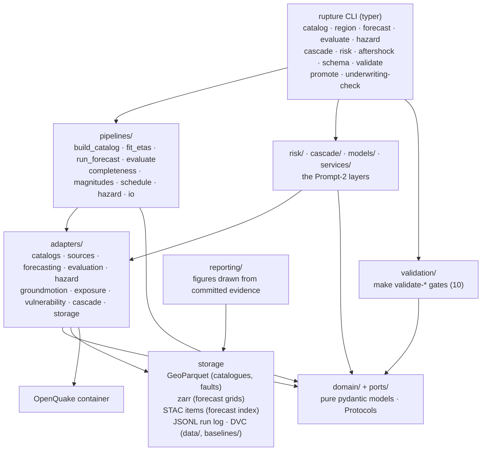

# Architecture

This document describes how the system that issues and
scores rate forecasts, computes hazard, loss and cascades, and serves an operational aftershock
forecast, is put together. Decisions are recorded in `docs/adr/`; this document explains the shape,
not the rationale.

Current as of 2026-09-03, with Prompt 1 and Prompt 2 both complete. Where the shape described here
and the tree disagree, the tree is right: `src/rupture/validation/registry.py` is the authority on
gates, `src/rupture/cli.py` on CLI nouns, `ls contracts/` on the published contract surface, and
`RELEASE_STATUS.md` on what has actually run.

## 1. C4 — context


- rupture pulls from public catalogues and model repositories; it never pushes to them.
- The OpenQuake engine runs in a pinned Docker container; rupture talks to it through a typed
  adapter (job files in, CSV exports out), never by importing `openquake.*`. Prompt 2 added a
  **second** ground-motion path — native GSIM implementations verified against OpenQuake's own
  committed test vectors — because the container is amd64-only and the gates must run offline from
  a fresh clone (ADR-0020). Both are described in § 5.
- Downstream consumers integrate only through the versioned JSON Schemas in `contracts/`.
- `serac` is a separate standalone repository. The two exchange schema *files*; neither is a code
  dependency of the other. `serac` is **not** empty: it has AOIs, and rupture consumes them through
  a labelled fallback while waiting for a real `slope-unit.v0` export (§ 6, ADR-0027).

## 2. C4 — containers



| Container | Responsibility | Lives in |
|---|---|---|
| CLI | one entry point, `rupture ...`; one typer sub-application per noun; not-yet-implemented verbs exit 2 with the phase that delivers them | `src/rupture/cli.py`, `src/rupture/commands/<noun>.py` |
| Pipelines | orchestration of a whole job (catalogue build, fit, issue, evaluate); pure functions over ports | `src/rupture/pipelines/` |
| Risk (F2) | ground motion → damage → loss → avoided loss, plus the FastAPI avoided-loss service | `src/rupture/risk/` (`damage`, `loss`, `avoided_loss`, `scenarios`, `exposure_schema`, `service`) |
| Cascade (F3) | ground-failure models from published coefficients, static covariates, the mass-movement discriminator | `src/rupture/cascade/` |
| Models | the challengers and the ensemble, and the dataset layer they share | `src/rupture/models/{challengers,data,ensemble}/` |
| Services | operational products with an API of their own | `src/rupture/services/aftershock/` |
| Adapters | the only code that touches the network, disk formats or Docker | `src/rupture/adapters/` (ten families, listed in § 3) |
| Domain + ports | models and Protocols; import nothing from the layers above (import-linter) | `src/rupture/domain/`, `src/rupture/ports/` |
| Storage | GeoParquet, zarr, STAC and JSONL run-log writers; DVC tracks the outputs | `src/rupture/adapters/storage/`, `data/`, `baselines/` |
| OpenQuake container | classical PSHA and scenario ground motion | `openquake/engine:3.26.2`, driven by `adapters/hazard/openquake_docker.py` |
| Validation | the gates behind `make validate-*`; each a `run(...) -> GateResult` | `src/rupture/validation/` |
| Reporting | figures for `reports/*.md`, drawn only from committed evidence; loads no model and issues no forecast | `src/rupture/reporting/` |

## 3. C4 — components: ports and adapters

| Port (`src/rupture/ports/`) | Contract (as defined in the port module) | Adapter(s) (`src/rupture/adapters/`) | Phase |
|---|---|---|---|
| `CatalogSource` | `source_id`, `adapter_version`; `fetch(region, start, end, *, min_magnitude=None) -> Catalog` over `[start, end)`; fetch or raise, never synthesise | `catalogs/comcat.py`, `catalogs/isc.py`, `catalogs/isc_gem.py`, `catalogs/gcmt.py` | 2A |
| (no port yet) fault and source-model ingestion | active faults and OpenQuake source models with provenance; adapter-only until a consumer needs a port | `sources/gem_faults.py`, `sources/openquake_sources.py` | 2A |
| `ForecastModel` | `model_id`, `model_version`; `fit(catalog, region, cutoff) -> FitResult`; `forecast(history, issue_time, horizon) -> ForecastGrid`; `parameter_snapshot() -> dict` | `forecasting/etas_mizrahi.py` | 2B |
| `Evaluator` | `evaluator_version`; `evaluate(forecast, target, tests, *, n_simulations=1000, alpha=0.05, seed=None) -> list[EvaluationResult]`; `compare(forecast, benchmark, target, *, alpha=0.05)` for paired T/W; `plot_bundle(forecast, target, results, out_dir)` | `evaluation/pycsep.py` | 2B |
| `HazardEngine` | `engine_id`, `engine_version`; `available() -> (bool, reason)`; `run_classical(ClassicalPSHAJob, work_dir) -> HazardCurveSet`; `run_scenario(ScenarioGroundMotionJob, work_dir) -> Path`. The two typed job models live in `ports/hazard_engine.py` | `hazard/openquake_docker.py` | 2C |
| `GridStore` | `save(grid) -> locator`; `load(forecast_id) -> ForecastGrid`; `list_ids(*, region_id, model_id)` | `storage/zarr_store.py`, `storage/stac.py` | 2B |
| `Tracker` | `log(RunRecord)`; `records(*, kind, region_id)`. `RunRecord.kind` is one of `fit`, `refit`, `issue`, `evaluate`, `build_catalog`, and carries `parameter_snapshot_hash` | `storage/run_log.py` (`JsonlTracker`) | 2B |
| `GroundMotionEngine` | `available() -> (bool, reason)`; `scenario(...) -> GroundMotionField` for one rupture at a set of sites; `supported_gsims()` — a GSIM absent from that tuple must not be requested | `groundmotion/native.py` (BC Hydro, BSSA14, verified against OpenQuake's committed vectors), `groundmotion/openquake_scenario.py` (the container path) | C2 |
| `ExposureSource` | `load(path=None, *, portfolio_id) -> ExposurePortfolio`; fetch or fail, never synthesise silently | `exposure/serac_export.py`, `exposure/geoparquet_import.py` | C2 |
| `VulnerabilityModel` | `fragility_for(taxonomy, imt) -> FragilityModel \| None`; `consequence_for(taxonomy)`; `portfolio_loss(...) -> ` expected loss with an interval. Returning `None` is the honest answer where no published function exists | `vulnerability/hazus.py`, `vulnerability/hydropower.py`, `vulnerability/library.py` | C2 |
| `CascadeModel` | `evaluate(field, *, scenario_id) -> GroundFailureField`: shaking plus static conditioning factors to susceptibility | `cascade/product.py`, `cascade/reproduction.py`, `cascade/shakemap.py`, `cascade/gorkha.py` (the models themselves are in `src/rupture/cascade/models.py`) | C3 |
| `SlopeUnitSource` | `units_for(aoi_id)`; `exposure(...) -> CascadeExposure`. Reads serac's export, or a committed fixture fallback that labels itself as one | `cascade/serac.py` | C3 |

Rules enforced by import-linter (`pyproject.toml`): `domain` imports nothing from `adapters`,
`pipelines`, `cli`, `validation`, `commands`, `risk`, `cascade`, `models` or `services`; `ports`
imports only `domain`; and the five original adapter families (`catalogs`, `sources`,
`forecasting`, `evaluation`, `hazard`) do not import each other. A domain model never knows which
agency or library produced its data.

**What those contracts do not cover, stated plainly.** The independence contract was written for
five adapter families and has not been extended to `groundmotion`, `exposure`, `vulnerability`,
`cascade` or `storage`. Nothing forbids `cascade` importing `models`, and `models` already imports
`pipelines` — six import statements across three modules — an inward-facing model reaching into
the orchestration layer. Both are
recorded in `RELEASE_STATUS.md` § Known gaps; a green `lint-imports` says nothing about them.

## 4. Batch forecast lifecycle

```mermaid
sequenceDiagram
  autonumber
  participant Sched as Scheduler (docs/SCHEDULER.md, Phase 2B description)
  participant Cat as build_catalog
  participant Mc as Mc estimation
  participant Fit as fit_etas
  participant Issue as run_forecast
  participant Eval as evaluate
  participant Arch as archive (zarr + STAC + DVC)

  Sched->>Cat: refresh catalogue [from, now) per region
  Cat->>Cat: merge sources, dedupe, homogenise Mw, log per event
  Cat->>Mc: catalogue (earthquakes only)
  Mc->>Mc: MAXC+0.2, b-value stability, mc_ks cross-check
  Mc-->>Fit: Mc, b (published in region.json)
  Note over Fit: refit only at declared boundaries<br/>(default 1 Jan 00:00Z); every refit logged
  Fit->>Fit: fit on origin_time < boundary; persist parameters, LL, diagnostics
  Fit-->>Issue: parameter_snapshot_hash
  loop daily / weekly / monthly issue times
    Issue->>Issue: input = events with origin_time < issue_time
    Issue->>Arch: ForecastGrid (1d/7d/30d; 365d at refit boundaries)
  end
  Note over Eval: runs only when issue_time + horizon <= now
  Eval->>Eval: target = [issue_time, issue_time+horizon), earthquakes only, frozen hash
  Eval->>Eval: N, M, S, L, CL (and T/W vs other models)
  Eval->>Arch: EvaluationResult + plot bundle → reports/eval/<forecast_id>/
  Arch->>Arch: schedule aggregate reports/eval/schedule-<region>-<model>.json
```

Cadence:

| Step | Cadence | Trigger |
|---|---|---|
| Catalogue refresh | daily | scheduler; also on demand |
| Mc estimation | with each full catalogue build; published, not silently updated | catalogue build |
| ETAS refit | yearly on 1 January 00:00:00Z by default; any other refit is a declared, logged boundary | calendar |
| Forecast issuance | daily (1 d, 7 d, 30 d horizons); 365 d at refit boundaries | scheduler |
| Evaluation | when a window closes, i.e. `now >= issue_time + horizon` | scheduler |
| Archival | every issued grid and evaluation is written once and never overwritten; DVC-tracked | pipelines |

Idempotence: issuing the same `(model, region, horizon, issue_time)` twice from the same parameter
snapshot must produce the same grid (fixed simulation seed recorded in the STAC item); the store
refuses to overwrite a differing grid.

## 5. Hazard / risk lane (F0, F2)

```
source model (NRML) + GSIM logic tree          ScenarioRupture (Gorkha / MHT / stochastic)
        │  ClassicalPSHAJob                             │
        ▼                                               ▼
OpenQuake engine (Docker, pinned)              GroundMotionEngine
        │  result parser                        ├─ native GSIMs (offline, verified)
        ▼                                       └─ openquake_scenario (container)
HazardCurveSet   (F0)                                   │
                                                        ▼
                        ExposurePortfolio ──► GroundMotionField
                                │                       │
                                ▼                       ▼
                     VulnerabilityModel ──────► damage ──► LossResult (MoneyRange + interval)
                                                        │
                                                        ▼
                                             AvoidedLossResponseV1  (F2)
                                                  │           │
                                                  ▼           ▼
                                     rupture underwriting-check   FastAPI (rupture.risk.service)
```

- **F0 (Prompt 1)** delivers the adapter, the typed job builder, the parser to `HazardCurveSet`,
  the OpenQuake bundled demo as an integration test, and ESHM20 ingestion for `turkiye-eaf`. No
  open NRML source model has been verified for `california` or `nepal-himalaya` (ADR-0008), and
  **no PSHA has been run for any region**; those are recorded gaps, not silently substituted.
- **F2 (Prompt 2)** is implemented end to end: exposure ingestion (serac export or GeoParquet
  import), a scenario ground-motion field, HAZUS and hydropower fragility with consequence
  functions, portfolio loss with intervals, and the avoided-loss computation. It is served two
  ways — `rupture risk run` / `rupture underwriting-check` on the CLI, and the FastAPI application
  at `rupture.risk.service:app`, which has been exercised with `TestClient` and **never served
  outside tests**.
- **Two ground-motion adapters, not one** (ADR-0020). The container path cannot run on an arm64
  host and cannot run offline, and the gates must do both, so the native GSIMs are the ones the
  risk gate and `underwriting-check` use. They are not a reimplementation taken on trust: every
  entry in the registry is checked against OpenQuake's own committed expected values at gate time,
  along with the sha256 of the coefficient tables. What this means for the brief's wording is set
  out in `RELEASE_STATUS.md` § Prompt 2 Gates: **`validate-risk` does not start the OpenQuake
  container**; `validate-hazard` is the gate that does, and only in CI.
- **`make underwriting-check` prices the portfolio.** It loads the serac Trishuli corridor,
  answers an `AvoidedLossRequestV1` against the MHT scenario, and prints expected loss and avoided
  loss with intervals, confidence tiers and provenance — exiting non-zero if any figure is missing
  or the response is a stub. The contract it round-trips is `contracts/avoided-loss.v1.json`
  (ADR-0021); `avoided-loss.v0.json` remains published because a version is never withdrawn.

## 6. Cascade lane and the `serac` interface (F3)

F3 (Prompt 2) takes a scenario or a large observed event, runs the two USGS ground-failure models
(Nowicki Jessee 2018 for landslide, Zhu 2017 for liquefaction) from their published coefficients,
overlays exposure, and reports cascade footprints. It never states that a slope will fail; it
reports susceptibility and what is exposed to it.

Its interface to the sibling `serac` repository is four file contracts, in both directions:

| Contract | Direction | State |
|---|---|---|
| `contracts/source-type-assessment.v0.json` | serac → rupture (and rupture's own catalogue tagging) | for a catalogued event, the probability that it is a mass movement (landslide, ice avalanche, rockfall) rather than a tectonic rupture, with the evidence used. Published by rupture first |
| `contracts/avoided-loss.v1.json` | rupture → consumers, shared shape with serac | expected loss with and without an intervention, with intervals, for a scenario or forecast. Reconciled with serac's shape in ADR-0021; `avoided-loss.v0.json` stays published |
| `contracts/cascade-exposure.v0.json` | rupture → consumers | slope units and assets exposed to a modelled cascade footprint, with the source of the units named |
| serac's `contracts/slope-unit.v0.json` | serac → rupture | consumed by `SeracSlopeUnitSource` |

**The slope-unit interface is live but unfed, and says so.** As of 2026-09-03 `serac` exists and
has AOIs (`lhende-khola-trishuli`, `chamoli-rishiganga`, `blatten-lotschental`) but has exported no
`slope-unit.v0` records and holds no DEM-derived terrain. `SeracSlopeUnitSource` resolves, in
order: a real export under `$SERAC_EXPORT_DIR/slope-units/`, then serac's AOI build, then the
committed byte-verbatim copy of that build under `tests/fixtures/cascade/serac/`. Routes 2 and 3
produce a **fallback** that emits one unit per serac source-zone polygon with **every terrain
attribute null**, because serac has no basis for them and rupture will not manufacture one. The
fallback labels itself — `slope_unit_source` reads `serac-aoi-fallback:<aoi>`, provenance is
`ASSUMED`, confidence is `UNQUALIFIED`, the terrain screens report **not applied**, and the record's
notes say how many units that affected (ADR-0027). Two field types disagree between the two
repositories' models (`glacier_cover` boolean against float, `elevation_band_m` pair against
string); the mapping is recorded in ADR-0027 rather than hidden.

Coordination is by **copying schema files** between the repositories; neither imports the other's
code. If `serac` publishes a differing schema, the reconciliation rule in ADR-0014 applies
(field-compatible superset, version bump) — which is what ADR-0021 did for avoided-loss.

## 7. Data layer

Directory layout (from `README.md`):

```
data/
  regions/<region>/region.geojson, region.json   git-tracked (small, authoritative)
  fixtures/<slice>/...parquet + provenance.json   git-tracked (real slices, <= 1 MB each)
  raw/        DVC   payloads as fetched (GeoJSON, FDSN text, NDK, CSV), sha256 in provenance
  interim/    DVC   per-source parsed catalogues, fault GeoParquet
  catalogs/   DVC   homogenised catalogue per region + homogenisation log
  forecasts/  DVC   <region>/<model>/<issue>.zarr + STAC items
tests/fixtures/   git   real slices for the Prompt-2 layers (cascade, risk, aftershock, models),
                        including third-party source vendored verbatim with its own provenance
baselines/
  etas/<region>/      the persisted FitResult (fit-result.v0.json shape) + diagnostics   DVC
  gridded/<region>/   ConvLSTM weights and normalisation state                           DVC
  ntpp/<region>/      the neural point-process weights                                   git
contracts/    git   19 versioned JSON Schemas (exported from the domain models,
                    drift-checked by `make schema-check`). Run `ls contracts/` for the list;
                    contracts/README.md describes each one and its model.
reports/      mostly ignored, but the published evidence is committed: the model cards,
              reports/protocol/*/eval/schedule-*.json, reports/challenger/** (the challenger
              schedules and the figures drawn from them) and reports/aftershock/**
```

`baselines/ntpp/` is committed while `baselines/etas/` and `baselines/gridded/` are not. That
asymmetry is deliberate — the neural weights are the only reproducible evidence for a negative
result, and they are small — and it is recorded in `RELEASE_STATUS.md` rather than tidied away.

| Concern | Choice |
|---|---|
| Catalogues, faults | pandas/geopandas → GeoParquet (`adapters/storage/geoparquet.py`) |
| Forecast grids | xarray → zarr (`adapters/storage/zarr.py`), one STAC item per issue (`adapters/storage/stac.py`) |
| Contracts | pydantic v2 models in `domain/`, exported to JSON Schema by `rupture schema export` |
| Versioning of large files | DVC. `dvc.yaml` declares `build_catalog`, `fit_etas`, `evaluate_schedule` per region; `dvc repro` needs network and is never run by the offline gates |
| DVC remote | default `local` remote at `.dvc/local-remote` (a placeholder so a fresh clone works); production: `dvc remote modify local url s3://<bucket>/rupture`, credentials via `AWS_PROFILE` (docs/CREDENTIALS.md) |

Git-tracked vs DVC-tracked: git holds code, docs, contracts, region definitions, fixtures and
`.dvc`/`dvc.yaml` pointers; DVC holds every fetched payload, derived catalogue, fit and forecast.
`.gitignore` excludes `data/raw`, `data/interim`, `data/catalogs`, `data/forecasts` and the
binary payloads under `baselines/`.

Fixtures policy: fixtures are real slices cut from real pulls (Gorkha 2015, Kahramanmaraş 2023,
Ridgecrest 2019, and a ComCat slice containing the landslide-type entry `us7000tbwb`); each has a
`provenance.json`; none is edited by hand; unit tests run on them with sockets disabled. Some
fixtures are third-party *source* vendored verbatim rather than data — the USGS ground-failure
reference implementation under `tests/fixtures/cascade/usgs_groundfailure/`, renamed `.py` →
`.py.txt` so ruff and mypy skip it, kept so every coefficient in `src/rupture/cascade/` can be
checked against its source offline. Because those files are never edited, rupture's rules about
the contents of rupture's own files do not apply to them; the one `TODO` in the tree is inside one
of them. See `docs/DATA_SOURCES.md` § Fixtures and `CLAUDE.md` § Repository conventions.

## 8. Deployment

- **Unit of deployment:** one plain Docker image built from `infra/docker/Dockerfile` containing
  the locked environment and the `rupture` CLI. It has no dependency on any hosted platform. The
  OpenQuake engine is a *second*, pinned public image that rupture drives; it is not baked into
  rupture's image.
- **Jobs:** portable manifests `infra/jobs/*.yaml` (`build-catalog`, `fit-etas`,
  `issue-forecast`, `evaluate-schedule`, `oq-classical`). Each names the image, the `rupture`
  command, inputs/outputs (DVC paths), resources, and carries an `aws:` annotation block
  (Batch/ECS sizing, S3 paths, IAM role name) that a deployer can read and any other platform can
  ignore. Nothing in the manifests is required to run the same command locally.
- **Scheduler:** described in `docs/SCHEDULER.md` — daily, idempotent issuance with a refit
  calendar. It is a description, not an implementation.
- **CI:** `.github/workflows/ci.yml` runs the **offline job** on every push and every pull request:
  ruff, mypy --strict, import-linter, the offline test suite, and the nine gates that need neither
  network nor Docker (`language`, `schema`, `catalog`, `etas`, `eval`, `cascade`, `risk`,
  `aftershock`, `challengers`) plus `make underwriting-check`. Its last step compares the `GATES`
  tuple in `src/rupture/validation/registry.py` against the gates the workflow claims to cover and
  fails if they disagree, so a gate added without a CI step breaks the build instead of rotting.
  The **`hazard-integration` job** (pull the pinned image, `validate-hazard`, the Docker
  integration tests) runs on manual dispatch and on pushes to `main`, with
  `RUPTURE_HAZARD_REQUIRE=1` so that a skip there is a failure. Docker is not assumed on developer
  machines; locally `make validate-hazard` skips with a printed reason.

## 9. What would change if F1 skill is zero

Suppose the pseudo-prospective schedule shows that ETAS (and every challenger) has no
information gain over a time-independent long-term rate model — that F1 adds nothing. What is
left standing?

- **F0 stands on its own.** Long-term hazard curves from a source model and GSIM logic tree are
  independent of any time-dependent forecast; they are what building codes and insurance pricing
  already use.
- **F2 scenario losses need no forecast.** "What does an M7.8 on the East Anatolian Fault cost
  this portfolio?" is a scenario question. Expected loss with and without a retrofit programme —
  the avoided-loss contract — is computed from the scenario (or from event-based risk over the
  long-term source model), exposure and fragility. It informs a retrofit or insurance decision
  whether or not anyone can say when the scenario happens.
- **F3 cascade footprints are scenario-conditional.** Landslide and liquefaction footprints for a
  given rupture depend on the scenario's ground motion, slope, wetness and soils, not on a rate
  forecast. The exposure overlay is likewise scenario-conditional.
- **Event-based risk on F0 alone** gives annualised loss and avoided loss over the investigation
  time from the long-term model; this is standard catastrophe-model practice.
- **What F1 would still supply** is the aftershock-period rate: after a large event, ETAS
  clustering rates over the following days and weeks are far above the long-term rate, and using
  them for post-event decisions (inspection sequencing, re-occupancy, temporary shelter siting)
  is established operational practice even where longer-horizon skill is weak. The schedule tests
  this too, because the Kahramanmaraş sequence sits inside it.

So the architecture is deliberately layered so that F1 can be switched off — or replaced by the
long-term rate — without changing a single contract in F0, F2 or F3. The value proposition
survives; the marketing claim "time-dependent" does not, and `RELEASE_STATUS.md` would say so.

## 10. Failure modes we design against

| Failure mode | Defence |
|---|---|
| **Leakage** — future events reach a fit or forecast; refits inside windows; k-fold splits | hard cutoff on `origin_time` asserted in tests on real timestamps; `parameter_snapshot_hash` constancy check; refits only at logged boundaries; k-fold forbidden by protocol; negative test with an injected post-cutoff event |
| **Overclaiming** — deterministic language, skill claimed from consistency tests, ledger inflation | every published claim carries its protocol, baseline and number (CLAUDE.md § How Rupture writes about results); pre-registration committed before test data is touched; protocol says consistency ≠ skill; promotion rule requires paired T-test with positive IGPE in 2 of 3 regions; `RELEASE_STATUS.md` under-claims by rule; qa-reviewer veto |
| **Fabricated fixtures** — synthetic rows presented as real, hand-edited fixtures | fixtures are slices of real pulls with `provenance.json` (`sha256` of the source payload); never edited by hand; adapters fetch or raise; unknowns are `null` |
| **Silent skips** — a gate or test that passes because it did nothing | `GateStatus.SKIPPED` is legal only with a printed reason; `make promote` prints every skip; not-implemented verbs exit 2 and say which phase delivers them |
| **Drifting contracts** — schema files diverge from the models, or change incompatibly under the same version | `rupture schema export --check` (`make schema-check`, in CI and in `VALIDATE_GATES`); `.vN` in the filename; additive-only within a version; contract tests round-trip fixtures |
| **Network in unit tests** — a test that passes only online, or pulls fresh data that changes | `make test` runs with `--disable-socket`; integration tests are marked and opt-in |
| **Unlogged provenance** — a row nobody can trace to a source and licence | provenance fields required on every record and fixture; `validate-catalog` checks them |
