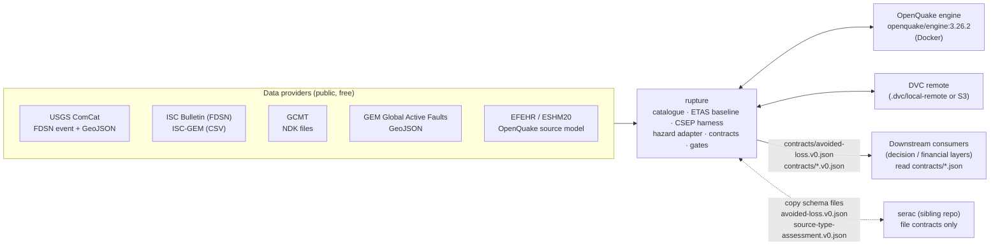
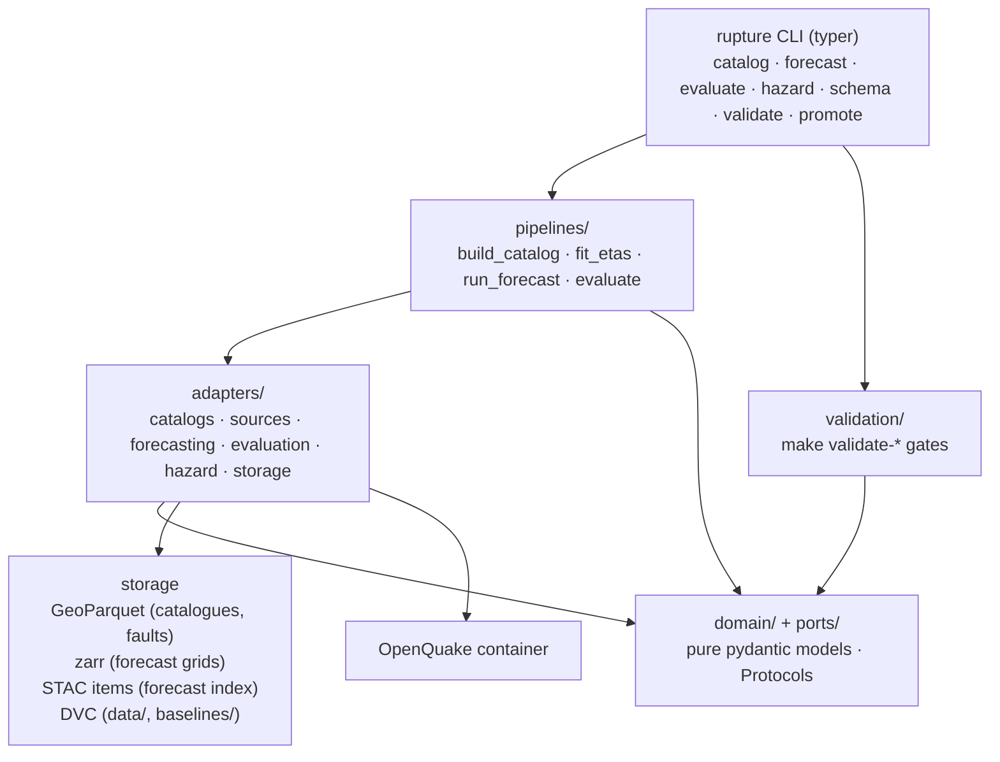

# Architecture

rupture does not predict earthquakes. This document describes how the system that issues and
scores rate forecasts, computes hazard and (from Prompt 2) loss and cascades, is put together.
Decisions are recorded in `docs/adr/`; this document explains the shape, not the rationale.

## 1. C4 — context



- rupture pulls from public catalogues and model repositories; it never pushes to them.
- The OpenQuake engine runs in a pinned Docker container; rupture talks to it through a typed
  adapter (job files in, CSV exports out), never by importing `openquake.*`.
- Downstream consumers integrate only through the versioned JSON Schemas in `contracts/`.
- `serac` is a separate standalone repository. The two exchange schema *files*; neither is a code
  dependency of the other. As of 2026-09-03 `serac` is empty, so rupture publishes first.

## 2. C4 — containers



| Container | Responsibility | Lives in |
|---|---|---|
| CLI | one entry point, `rupture ...`; one typer sub-application per noun; not-yet-implemented verbs exit 2 with the phase that delivers them | `src/rupture/cli.py`, `src/rupture/commands/<noun>.py` |
| Pipelines | orchestration of a whole job (catalogue build, fit, issue, evaluate); pure functions over ports | `src/rupture/pipelines/` |
| Adapters | the only code that touches the network, disk formats or Docker | `src/rupture/adapters/` |
| Domain + ports | models and Protocols; import nothing from the layers above (import-linter) | `src/rupture/domain/`, `src/rupture/ports/` |
| Storage | GeoParquet, zarr, STAC writers; DVC tracks the outputs | `src/rupture/adapters/storage/`, `data/`, `baselines/` |
| OpenQuake container | classical PSHA and scenario ground motion | `openquake/engine:3.26.2`, driven by `adapters/hazard/openquake_docker.py` |
| Validation | the gates behind `make validate-*`; each a `run(...) -> GateResult` | `src/rupture/validation/` |

## 3. C4 — components: ports and adapters

| Port (`src/rupture/ports/`) | Contract (as defined in the port module) | Adapter(s) (`src/rupture/adapters/`) | Phase |
|---|---|---|---|
| `CatalogSource` | `source_id`, `adapter_version`; `fetch(region, start, end, *, min_magnitude=None) -> Catalog` over `[start, end)`; fetch or raise, never synthesise | `catalogs/comcat.py`, `catalogs/isc.py`, `catalogs/isc_gem.py`, `catalogs/gcmt.py` | 2A |
| (no port yet) fault and source-model ingestion | active faults and OpenQuake source models with provenance; adapter-only until a consumer needs a port | `sources/gem_faults.py`, `sources/openquake_sources.py` | 2A |
| `ForecastModel` | `model_id`, `model_version`; `fit(catalog, region, cutoff) -> FitResult`; `forecast(history, issue_time, horizon) -> ForecastGrid`; `parameter_snapshot() -> dict` | `forecasting/etas_mizrahi.py` | 2B |
| `Evaluator` | `evaluator_version`; `evaluate(forecast, target, tests, *, n_simulations=1000, alpha=0.05, seed=None) -> list[EvaluationResult]`; `compare(forecast, benchmark, target, *, alpha=0.05)` for paired T/W; `plot_bundle(forecast, target, results, out_dir)` | `evaluation/pycsep.py` | 2B |
| `HazardEngine` | `engine_id`, `engine_version`; `available() -> (bool, reason)`; `run_classical(ClassicalPSHAJob, work_dir) -> HazardCurveSet`; `run_scenario(ScenarioGroundMotionJob, work_dir) -> Path`. The two typed job models live in `ports/hazard_engine.py` | `hazard/openquake_docker.py` | 2C |
| `GridStore` | `save(grid) -> locator`; `load(forecast_id) -> ForecastGrid`; `list_ids(*, region_id, model_id)` | `storage/zarr.py`, `storage/stac.py` | 2B |
| `Tracker` | `log(RunRecord)`; `records(*, kind, region_id)`. `RunRecord.kind` is one of `fit`, `refit`, `issue`, `evaluate`, `build_catalog`, and carries `parameter_snapshot_hash` | file-backed run log adapter under `storage/`; module name fixed when implemented | 2B |

Rules enforced by import-linter (`pyproject.toml`): `domain` imports nothing from `adapters`,
`pipelines`, `cli` or `validation`; `ports` imports only `domain`; adapter families do not import
each other. A domain model never knows which agency or library produced its data.

## 4. Batch forecast lifecycle

```mermaid
sequenceDiagram
  autonumber
  participant Sched as Scheduler (docs/SCHEDULER.md, Phase 2B description)
  participant Cat as build_catalog
  participant Mc as Mc estimation
  participant Fit as fit_etas
  participant Issue as run_forecast
  participant Eval as evaluate
  participant Arch as archive (zarr + STAC + DVC)

  Sched->>Cat: refresh catalogue [from, now) per region
  Cat->>Cat: merge sources, dedupe, homogenise Mw, log per event
  Cat->>Mc: catalogue (earthquakes only)
  Mc->>Mc: MAXC+0.2, b-value stability, mc_ks cross-check
  Mc-->>Fit: Mc, b (published in region.json)
  Note over Fit: refit only at declared boundaries<br/>(default 1 Jan 00:00Z); every refit logged
  Fit->>Fit: fit on origin_time < boundary; persist parameters, LL, diagnostics
  Fit-->>Issue: parameter_snapshot_hash
  loop daily / weekly / monthly issue times
    Issue->>Issue: input = events with origin_time < issue_time
    Issue->>Arch: ForecastGrid (1d/7d/30d; 365d at refit boundaries)
  end
  Note over Eval: runs only when issue_time + horizon <= now
  Eval->>Eval: target = [issue_time, issue_time+horizon), earthquakes only, frozen hash
  Eval->>Eval: N, M, S, L, CL (and T/W vs other models)
  Eval->>Arch: EvaluationResult + plot bundle → reports/eval/<forecast_id>/
  Arch->>Arch: schedule aggregate reports/eval/schedule-<region>-<model>.json
```

Cadence:

| Step | Cadence | Trigger |
|---|---|---|
| Catalogue refresh | daily | scheduler; also on demand |
| Mc estimation | with each full catalogue build; published, not silently updated | catalogue build |
| ETAS refit | yearly on 1 January 00:00:00Z by default; any other refit is a declared, logged boundary | calendar |
| Forecast issuance | daily (1 d, 7 d, 30 d horizons); 365 d at refit boundaries | scheduler |
| Evaluation | when a window closes, i.e. `now >= issue_time + horizon` | scheduler |
| Archival | every issued grid and evaluation is written once and never overwritten; DVC-tracked | pipelines |

Idempotence: issuing the same `(model, region, horizon, issue_time)` twice from the same parameter
snapshot must produce the same grid (fixed simulation seed recorded in the STAC item); the store
refuses to overwrite a differing grid.

## 5. Hazard / risk lane (F0, F2)

```
source model (NRML) + GSIM logic tree
        │  ClassicalPSHAJob / ScenarioGroundMotionJob  (typed job → job.ini + inputs)
        ▼
OpenQuake engine (Docker, pinned)  ──►  hazard curves / GMFs (CSV export)
        │  result parser
        ▼
HazardCurveSet                                   ┐
        │                                        │ Prompt 2
        ▼                                        │
ExposurePortfolio + fragility/vulnerability ──► LossResult ──► AvoidedLossResponse
                                                 ┘
```

- **Prompt 1** delivers the adapter, the typed job builder, the parser to `HazardCurveSet`, the
  OpenQuake bundled demo as an integration test, and ESHM20 ingestion for `turkiye-eaf`. No open
  NRML source model has been verified for `california` or `nepal-himalaya` (ADR-0008); those are
  recorded gaps, not silently substituted.
- **Prompt 2** delivers F2: exposure ingestion, scenario and event-based risk through the same
  adapter, and the avoided-loss computation. The **contract is published now**
  (`contracts/avoided-loss.v0.json`) so that consumers can build against it; `make
  underwriting-check` validates the request round-trip and exits non-zero "not implemented:
  Prompt 2".

## 6. Cascade lane and the `serac` interface (F3)

F3 (Prompt 2) takes a scenario or a large observed event, runs or ingests USGS ground-failure
models (landslide, liquefaction), overlays exposure, and reports cascade footprints. Its interface
to the sibling `serac` repository is two file contracts:

| Contract | Direction | Meaning |
|---|---|---|
| `contracts/source-type-assessment.v0.json` | serac → rupture (and rupture's own catalogue tagging) | for a catalogued event, the probability that it is a mass movement (landslide, ice avalanche, rockfall) rather than a tectonic rupture, with the evidence used |
| `contracts/avoided-loss.v0.json` | rupture → consumers, shared shape with serac | expected loss with and without an intervention, with intervals, for a scenario or forecast |

Coordination is by **copying schema files** between the repositories; neither imports the other's
code. As of 2026-09-03 the `serac` repository is empty, so rupture publishes both schemas first
and `serac` is expected to copy them; if `serac` later publishes a differing schema, the
reconciliation rule in ADR-0014 applies (field-compatible superset, version bump).

## 7. Data layer

Directory layout (from `README.md`):

```
data/
  regions/<region>/region.geojson, region.json   git-tracked (small, authoritative)
  fixtures/<slice>/...parquet + provenance.json   git-tracked (real slices, <= 1 MB each)
  raw/        DVC   payloads as fetched (GeoJSON, FDSN text, NDK, CSV), sha256 in provenance
  interim/    DVC   per-source parsed catalogues, fault GeoParquet
  catalogs/   DVC   homogenised catalogue per region + homogenisation log
  forecasts/  DVC   <region>/<model>/<issue>.zarr + STAC items
baselines/
  etas/<region>/   the persisted FitResult (fit-result.v0.json shape) + diagnostics   DVC
contracts/    git   11 versioned JSON Schemas (exported, drift-checked): event, catalog, region,
                    forecast-grid, fit-result, evaluation-result, hazard-curve-set,
                    exposure-portfolio, loss-result, avoided-loss, source-type-assessment
reports/      not committed; schedule aggregates that back RELEASE_STATUS.md are DVC-tracked
```

| Concern | Choice |
|---|---|
| Catalogues, faults | pandas/geopandas → GeoParquet (`adapters/storage/geoparquet.py`) |
| Forecast grids | xarray → zarr (`adapters/storage/zarr.py`), one STAC item per issue (`adapters/storage/stac.py`) |
| Contracts | pydantic v2 models in `domain/`, exported to JSON Schema by `rupture schema export` |
| Versioning of large files | DVC. `dvc.yaml` declares `build_catalog`, `fit_etas`, `evaluate_schedule` per region; `dvc repro` needs network and is never run by the offline gates |
| DVC remote | default `local` remote at `.dvc/local-remote` (a placeholder so a fresh clone works); production: `dvc remote modify local url s3://<bucket>/rupture`, credentials via `AWS_PROFILE` (docs/CREDENTIALS.md) |

Git-tracked vs DVC-tracked: git holds code, docs, contracts, region definitions, fixtures and
`.dvc`/`dvc.yaml` pointers; DVC holds every fetched payload, derived catalogue, fit and forecast.
`.gitignore` excludes `data/raw`, `data/interim`, `data/catalogs`, `data/forecasts` and the
binary payloads under `baselines/`.

Fixtures policy: fixtures are real slices cut from real pulls (Gorkha 2015, Kahramanmaraş 2023,
Ridgecrest 2019, and a ComCat slice containing the landslide-type entry `us7000tbwb`); each has a
`provenance.json`; none is edited by hand; unit tests run on them with sockets disabled. See
`docs/DATA_SOURCES.md` § Fixtures.

## 8. Deployment

- **Unit of deployment:** one plain Docker image built from `infra/docker/Dockerfile` containing
  the locked environment and the `rupture` CLI. It has no dependency on any hosted platform. The
  OpenQuake engine is a *second*, pinned public image that rupture drives; it is not baked into
  rupture's image.
- **Jobs:** portable manifests `infra/jobs/*.yaml` (`build-catalog`, `fit-etas`,
  `issue-forecast`, `evaluate-schedule`, `oq-classical`). Each names the image, the `rupture`
  command, inputs/outputs (DVC paths), resources, and carries an `aws:` annotation block
  (Batch/ECS sizing, S3 paths, IAM role name) that a deployer can read and any other platform can
  ignore. Nothing in the manifests is required to run the same command locally.
- **Scheduler:** described in `docs/SCHEDULER.md` (Phase 2B deliverable) — daily, idempotent
  issuance with a refit calendar. It is a description, not an implementation, in Prompt 1.
- **CI:** `.github/workflows/ci.yml` runs the offline job (ruff, mypy --strict, import-linter,
  offline tests, language gate, contract drift) on every push and PR, and the
  `hazard-integration` job (OpenQuake demo in Docker) on manual dispatch only until the hazard
  adapter lands in Phase 2C, which flips it to run on pushes to `main` as well. Docker is not
  assumed on developer machines; locally `make validate-hazard` skips with a printed reason.

## 9. What would change if F1 skill is zero

Suppose the pseudo-prospective schedule shows that ETAS (and every challenger) has no
information gain over a time-independent long-term rate model — that F1 adds nothing. What is
left standing?

- **F0 stands on its own.** Long-term hazard curves from a source model and GSIM logic tree are
  independent of any time-dependent forecast; they are what building codes and insurance pricing
  already use.
- **F2 scenario losses need no forecast.** "What does an M7.8 on the East Anatolian Fault cost
  this portfolio?" is a scenario question. Expected loss with and without a retrofit programme —
  the avoided-loss contract — is computed from the scenario (or from event-based risk over the
  long-term source model), exposure and fragility. It informs a retrofit or insurance decision
  whether or not anyone can say when the scenario happens.
- **F3 cascade footprints are scenario-conditional.** Landslide and liquefaction footprints for a
  given rupture depend on the scenario's ground motion, slope, wetness and soils, not on a rate
  forecast. The exposure overlay is likewise scenario-conditional.
- **Event-based risk on F0 alone** gives annualised loss and avoided loss over the investigation
  time from the long-term model; this is standard catastrophe-model practice.
- **What F1 would still supply** is the aftershock-period rate: after a large event, ETAS
  clustering rates over the following days and weeks are far above the long-term rate, and using
  them for post-event decisions (inspection sequencing, re-occupancy, temporary shelter siting)
  is established operational practice even where longer-horizon skill is weak. The schedule tests
  this too, because the Kahramanmaraş sequence sits inside it.

So the architecture is deliberately layered so that F1 can be switched off — or replaced by the
long-term rate — without changing a single contract in F0, F2 or F3. The value proposition
survives; the marketing claim "time-dependent" does not, and `RELEASE_STATUS.md` would say so.

## 10. Failure modes we design against

| Failure mode | Defence |
|---|---|
| **Leakage** — future events reach a fit or forecast; refits inside windows; k-fold splits | hard cutoff on `origin_time` asserted in tests on real timestamps; `parameter_snapshot_hash` constancy check; refits only at logged boundaries; k-fold forbidden by protocol; negative test with an injected post-cutoff event |
| **Overclaiming** — deterministic language, skill claimed from consistency tests, ledger inflation | banned-language gate; protocol says consistency ≠ skill; promotion rule requires paired T-test with positive IGPE in 2 of 3 regions; `RELEASE_STATUS.md` under-claims by rule; qa-reviewer veto |
| **Fabricated fixtures** — synthetic rows presented as real, hand-edited fixtures | fixtures are slices of real pulls with `provenance.json` (`sha256` of the source payload); never edited by hand; adapters fetch or raise; unknowns are `null` |
| **Silent skips** — a gate or test that passes because it did nothing | `GateStatus.SKIPPED` is legal only with a printed reason; `make promote` prints every skip; not-implemented verbs exit 2 and say which phase delivers them |
| **Drifting contracts** — schema files diverge from the models, or change incompatibly under the same version | `rupture schema export --check` (`make schema-check`, in CI and in `VALIDATE_GATES`); `.vN` in the filename; additive-only within a version; contract tests round-trip fixtures |
| **Network in unit tests** — a test that passes only online, or pulls fresh data that changes | `make test` runs with `--disable-socket`; integration tests are marked and opt-in |
| **Unlogged provenance** — a row nobody can trace to a source and licence | provenance fields required on every record and fixture; `validate-catalog` checks them |
