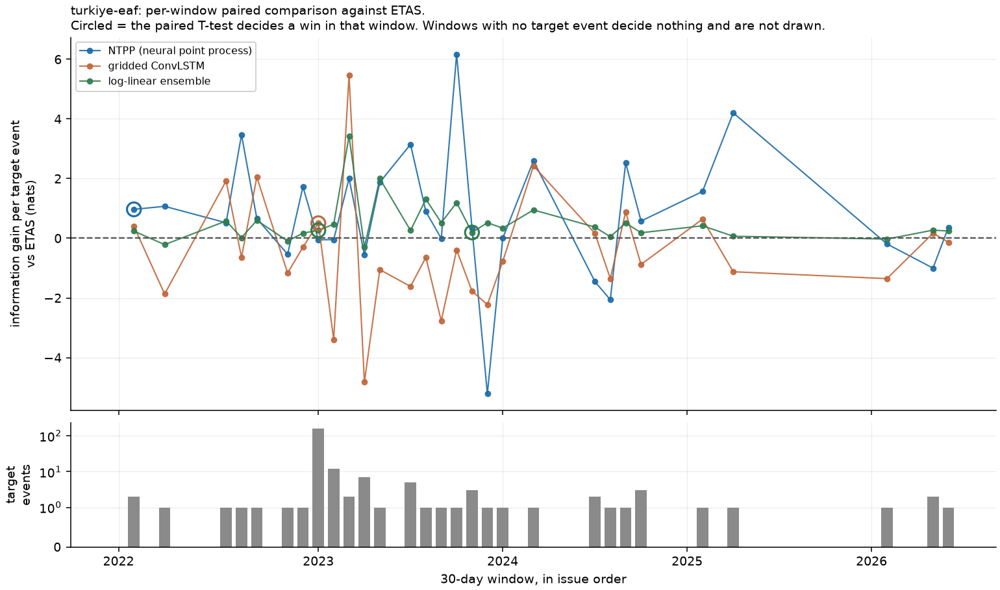
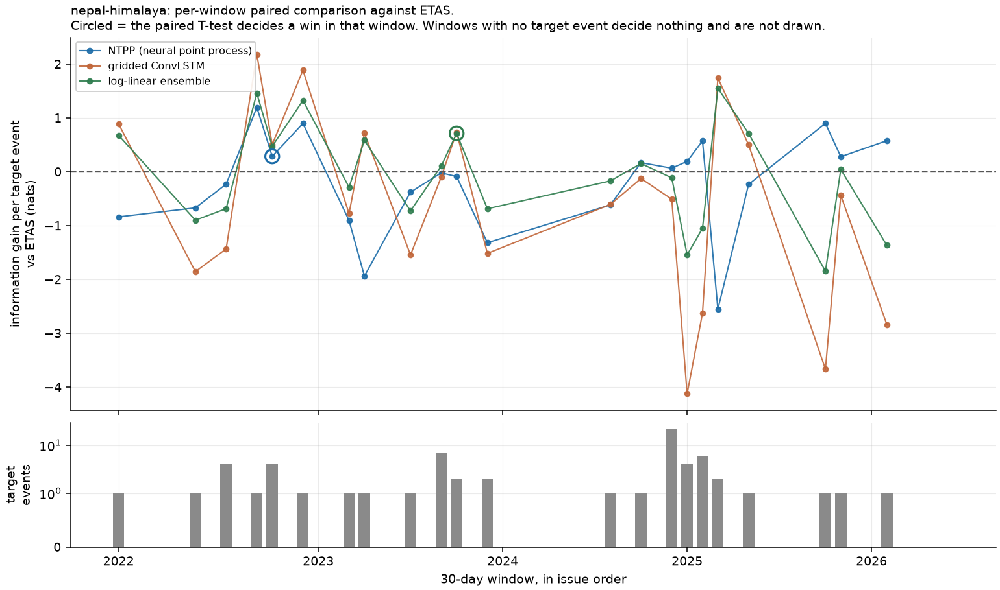
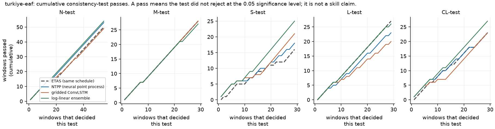
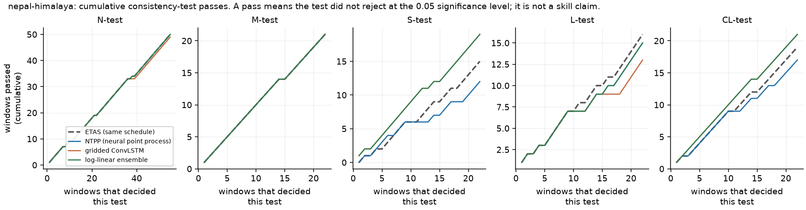
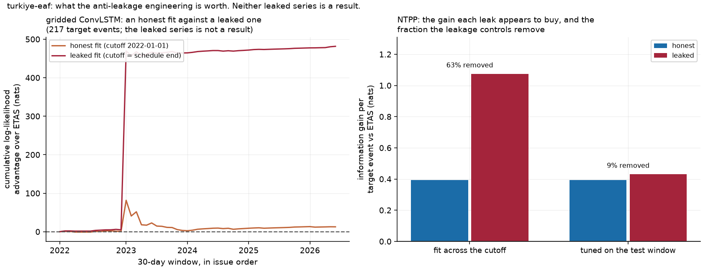
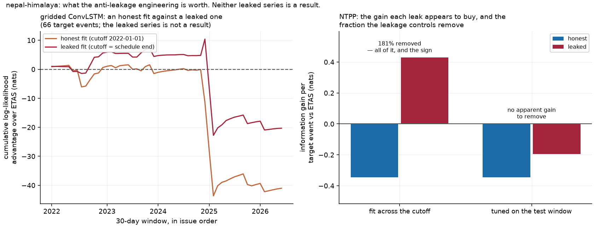

# Challenger evaluation

**The challenger did not beat ETAS.** That is the result, it is the expected result, and it is
reported here as the deliverable it is. rupture does not forecast individual earthquakes; this
document asks a narrower question — whether a learned model issues *better calibrated rate
forecasts* than the operational ETAS baseline under the protocol fixed in
`docs/EVALUATION_PROTOCOL.md` before any model was fitted.

Written 2026-09-03. Covers all three challengers: the neural temporal point process (C1a), the
gridded deep model (C1b) and the log-linear ensemble. **None is promoted.**

Every figure below is rendered from the committed JSON evidence by
`uv run python -m rupture.reporting.challenger_plots`
(`src/rupture/reporting/challenger_plots.py`). That module loads no model, issues no forecast and
refits nothing: its only inputs are the schedule files named in each caption, so a figure here
cannot disagree with the numbers in the tables — it is those numbers, drawn. The rule, and why it
is a rule, is ADR-0037.

## The promotion rule, and what it demands

A challenger is promotable only if, across the pseudo-prospective schedule:

1. its N/M/S/L pass rates are **at or above ETAS's** in each region, over at least 12 consecutive
   30-day windows; **and**
2. it **wins the paired T-test** against ETAS at α = 0.05 with positive information gain per event,

in **at least two of the three** protocol regions.

## C1a — neural temporal point process

A marked Hawkes process whose triggering kernels are convex mixtures over Omori and power-law
bases, with the mixture weights produced by a small network from each event's magnitude and depth.
Productivity is parameterised by branching ratio and magnitude sensitivity so the process is
**subcritical by construction**: unconstrained maximum likelihood went supercritical on every
catalogue (1.83 on Türkiye), and the constraint was fixed on the *training-set* branching ratio,
before any test window was scored.

Trained on the real regional catalogues at the protocol cutoff `2022-01-01`, scored over the full
55-window schedule, and compared against ETAS run through the **same** schedule (no refits, 100
continuations for both) so the comparison is symmetric.

The ETAS rows here are a **matched re-run** — no refits, 100 continuations, same as the challenger —
so the comparison is symmetric. They differ from the published baseline of record in
`docs/BASELINE_RESULTS.md`, which uses yearly refits and 1000 continuations. Both are stated.

| Region | Model | N | M | S | L | CL |
|---|---|---|---|---|---|---|
| `turkiye-eaf` | NTPP | 53/55 | 28/29 | 18/29 | 23/29 | 23/29 |
| | ETAS (same run) | 50/55 | 28/29 | 16/29 | **27/29** | 23/29 |
| `nepal-himalaya` | NTPP | 50/55 | 21/22 | 12/22 | 15/22 | 17/22 |
| | ETAS (same run) | 50/55 | 21/22 | **15/22** | **16/22** | **19/22** |

Paired comparison: Türkiye mean information gain **+0.394 nats per event**, but **1 T-test win in
10 windows** and **0 W-test wins in 29**. Nepal **−0.346 nats per event**, 1 win in 9, 0 in 22.

**Verdict: not promotable, in either region.** Condition 1 fails on the likelihood test in Türkiye
and on both the spatial and likelihood tests in Nepal. Condition 2 fails in both: a positive mean
information gain carried by one window in ten is not a win, it is a heavy tail. Condition 3 is
unreachable because California was not fitted — 55,828 training events against a likelihood that
is quadratic in event count.

The researcher **tightened the verdict function** after noticing that a looser reading — any
T-test win plus a positive mean — would have passed Türkiye on the strength of that single window.
That is the correct instinct, and it is why the rule is mechanical and written down in advance.

## The leaky ablation — what the discipline is worth

Required by ADR-0022 and the brief. One deliberately leaky variant was run and is labelled
unmistakably as an ablation. It is not a result and no promotion decision uses it.

| Ablation | Türkiye | Nepal |
|---|---|---|
| Fit on the whole catalogue (across the cutoff) | +0.68 nats/event | +0.77 nats/event |
| Tune hyperparameters on the test window | +0.037 | +0.151 |

**On Nepal the fit leak flips the sign.** A model that honestly *loses* to ETAS by 0.35 nats per
event appears to *win* by 0.43, and its spatial-test pass rate moves from 12/22 — below the
baseline — to 18/22, above it. Someone reporting that number in good faith would be reporting a
challenger that beats the operational baseline in a region where in truth it does not.

The Türkiye case is more insidious. There the same leak barely moves the pass rates while nearly
tripling the information gain, so **neither view catches it alone**: a reader checking consistency
tests would see nothing wrong, and a reader checking information gain would see a large
improvement. Only the two together, plus the knowledge that the fit saw the future, reveal it.

This is the concrete answer to "why not just use random k-fold". Leakage does not announce itself.
It arrives as good news, in the region where the honest model is weakest, and it survives the
checks a careful person would run.

Stated as the brief asks — as a *fraction* of apparent skill rather than as a difference — the
Türkiye fit leak accounts for **63 % of the apparent gain**, and the Nepal fit leak for **181 %**:
all of it, and the sign as well. The full accounting across all three models is in
§ "What fraction of the apparent skill was leakage" below.

## C1b — gridded deep model, and the ensemble

One ConvLSTM layer (about 5,200 parameters) over causal lookback frames of rasterised counts plus
four static covariates: fault-trace length per cell from the GEM Global Active Faults database,
historical rate, mean depth and shallow fraction. The head is zero-initialised and added to a
climatological log-rate, so an untrained network *is* the smoothed history and training can only
be judged by what it adds.

The ensemble is a log-linear mixture, `log λ = Σ wₖ log λₖ`, renormalised to the weighted geometric
mean of component totals, with weights chosen by grid search **on validation windows only** and
hard assertions that no search window reaches the test cutoff.

Both were scored on the same 55 windows, with **identical issue times and identical target counts**
to the published ETAS schedules.

| Region | Model | N | M | S | L | CL |
|---|---|---|---|---|---|---|
| `nepal-himalaya` | ETAS | 0.93 | 0.95 | 0.73 | 0.77 | 0.86 |
| | gridded | 0.89 | 0.95 | 0.86 | **0.59** | 0.95 |
| | ensemble | 0.91 | 0.95 | 0.86 | 0.68 | 0.95 |
| `turkiye-eaf` | ETAS | 0.91 | 0.93 | 0.69 | 0.90 | 0.86 |
| | gridded | 0.89 | 0.97 | 0.72 | **0.69** | 0.79 |
| | ensemble | **0.98** | 0.93 | **0.86** | 0.90 | **0.93** |

Per-window paired testing can decide only 9 or 10 of 55 windows, so a pooled paired test over all
target events was used as well:

| Region | Model | Target events | Information gain per event | 95 % interval | Beats ETAS |
|---|---|---|---|---|---|
| `nepal-himalaya` | gridded | 66 | −0.622 | [−1.105, −0.138] | no |
| | ensemble | 66 | −0.079 | [−0.346, +0.188] | no |
| `turkiye-eaf` | gridded | 217 | +0.059 | [−0.301, +0.419] | no |
| | ensemble | 217 | **+0.335** | [+0.267, +0.404] | **yes** (W-test agrees) |

**Verdict: neither is promoted.** The gridded model fails both conditions in both regions. The
ensemble meets both conditions in Türkiye and only there; the rule requires two of three regions,
and Nepal is a loss.

## The schedule, window by window

The tables above are pooled. Pooling is what the promotion rule scores, but it hides the shape of
the evidence, and the shape is the argument: a pooled mean carried by two windows out of fifty-five
is not the same object as a pooled mean carried by fifty.

*Per-window information gain per target event against ETAS, all three challengers, with the target
count of each window underneath (log scale). Circles mark the windows where the paired T-test
decides a win. Windows holding no target event decide nothing and are not drawn. Source:
`reports/challenger/<region>/schedule-<region>-challengers.json` and
`reports/protocol/<region>/eval/schedule-<region>-ntpp.json`.*

Three things are visible here that no table shows. The target counts are dominated by one bar —
Kahramanmaraş, 160 events in the window issued 2023-01-26 — and everything else in Türkiye is one
or two events. The per-window gains swing across ±5 nats and cross zero constantly, which is what
"1 T-test win in 10 windows" looks like from the inside. And the ensemble (green) is visibly the
flattest of the three: it deviates least from ETAS, which is consistent with what it turns out to
be doing — correcting a calibration error rather than adding information.

*Cumulative count of windows passed, per consistency test, for each challenger against the matched
ETAS re-run. Promotion condition 1 — "pass rates at or above ETAS's in each region" — is read off
the end of each line: a challenger line finishing below the dashed ETAS line fails that test. The
x-axis counts only windows that decided the test in question, which is why the N panel runs to 55
and the rest stop at 29 (Türkiye) and 22 (Nepal). A pass means a test did not reject at the 0.05
significance level; it is not a skill claim.*

### The one positive result, and why it is not a promotion

The Türkiye ensemble is the only thing in this project that beat ETAS on a protocol metric, so it
received the most scrutiny, not the least. Four checks were run against it:

- **Is it an artefact of the log floor?** No. Zero of 283 target events fell in a floored cell (283 spans both regions: Türkiye's 217 plus Nepal's 66).
- **Is it the tempering arithmetic rather than the model?** No. Flattening the challenger's spatial
  field to uniform collapses the gain to +0.032 and drives the weights to 0.99/0.01, so the gain
  comes from the smoothed-seismicity field.
- **Is it one window?** No. Removing the Kahramanmaraş window *raises* the gain to +0.528.
- **Is the interval trustworthy?** **No.** The Student-t interval assumes independent events, and
  aftershocks are not independent. Read the sign, not the p-value.

And the honest characterisation of what was won: the gain is a **calibration correction to a
baseline that over-forecasts aftershock totals by two to six times**, not new information about
where or when earthquakes occur. That is worth having and it is not a discovery.

**No leaky variant of the ensemble was run.** The leak figure that sits next to this schedule —
**+2.16 nats per event** in Türkiye, about 6.4 times the largest honest gain anywhere in this
evaluation, and **+0.31** in Nepal — belongs to the **gridded ConvLSTM**: it is the difference
between a gridded fit whose cutoff is the schedule end and the honest one, recorded as
`leaky_ablation` in `reports/challenger/<region>/schedule-<region>-challengers.json` with
`what: "a gridded fit whose cutoff is the schedule end…"`. An earlier revision of this document
attributed it to the ensemble; that was wrong, and it mattered, because the ensemble is the one
model here with a positive result and pinning the largest leak on it misstates both. Across the two
models that were leaked at all — NTPP and gridded — the fit leak is worth between +0.31 and +2.16
nats per event. Every figure in this paragraph is in the committed JSON, so a reader can check it.

The gridded model does train (11.1 % and 3.7 % held-out likelihood improvement over its untrained
state) but learns a near-static spatial correction: after a month containing 160 events its
forecast total moves 4.4 %, where the ETAS baseline's moves 56-fold. It is, in effect, a smoothed
seismicity map that does not respond to a sequence.

## What fraction of the apparent skill was leakage

The brief asks for this as a fraction, not as a difference, so here it is as a fraction. The
quantity is

> fraction removed = (leaked information gain − honest information gain) ÷ leaked information gain

computed per model and region, in nats per target event against ETAS, from the committed evidence.
It is only meaningful where the leaked variant showed an advantage over ETAS in the first place;
where the leaked variant still *loses* to ETAS there is no apparent skill to remove, and the cell
says so rather than reporting a ratio of two negative numbers.

| Model | Region | Leak | Leaked IG/event | Honest IG/event | Fraction of apparent skill removed |
|---|---|---|---|---|---|
| NTPP | `turkiye-eaf` | fit across the cutoff | +1.074 | +0.394 | **63 %** |
| NTPP | `turkiye-eaf` | hyperparameters tuned on the test window | +0.430 | +0.394 | **9 %** |
| NTPP | `nepal-himalaya` | fit across the cutoff | +0.429 | −0.346 | **181 %** — all of it, and the sign |
| NTPP | `nepal-himalaya` | hyperparameters tuned on the test window | −0.195 | −0.346 | n/a: the leaked variant still loses to ETAS |
| gridded ConvLSTM | `turkiye-eaf` | fit at the schedule end | +2.219 | +0.059 | **97 %** |
| gridded ConvLSTM | `nepal-himalaya` | fit at the schedule end | −0.308 | −0.622 | n/a: the leaked variant still loses to ETAS |
| log-linear ensemble | both | — | — | +0.335 / −0.079 | no leaked ensemble variant was run |

Sources, field by field: NTPP rows are
`reports/protocol/<region>/eval/ablations-<region>-ntpp.json` →
`<leak>.delta.information_gain_vs_etas.{honest,leaky}`. Gridded rows are
`reports/challenger/<region>/schedule-<region>-challengers.json` → `leaky_ablation`, where the
leaked and honest gains against ETAS are `(poisson_log_likelihood[leaky|honest] −
poisson_log_likelihood[etas]) / target_events`; that arithmetic reproduces
`models["gridded-convlstm"].pooled_paired_test.information_gain_per_event` to every printed digit
(0.058714603109 in Türkiye, −0.621536823702 in Nepal), which is the check that the ablation and the
schedule are the same run rather than two runs that happen to sit in one file. The ensemble row's
honest values are
`models["ensemble-loglinear"].pooled_paired_test.information_gain_per_event`.

**The headline, under-claimed:** in the four cases where a leaked model had any apparent advantage
over ETAS to lose, the leakage controls removed **9 %, 63 %, 97 % and 181 %** of it. The two large
ones are fit leaks — a model allowed to fit across its own scoring window. The 97 % is the starkest:
the gridded ConvLSTM's apparent +2.22 nats per event over ETAS in Türkiye is +0.06 once it may only
see the past, which is to say almost the whole of it was an artefact of the cutoff. The 181 % is the
most dangerous, because a fraction above 100 % means the honest model is on the other side of zero:
in Nepal the leak does not exaggerate a win, it manufactures one.

*Left panel: the cumulative log-likelihood advantage over ETAS of the honest gridded fit against the
leaked one, window by window. In Türkiye the two separate almost entirely at the Kahramanmaraş
window — the leaked fit had seen it — and never reconverge. Right panel: the NTPP's information gain
under each leak against its honest value, annotated with the fraction the controls remove. Neither
leaked series is a result, and no promotion decision uses one.*

The reason this is the most useful number in the project is that it is the one thing here that
generalises. The challengers' scores are about these models, these regions and these 55 windows. The
fraction above is about what a leaked evaluation would have told you, and nothing in it is specific
to a neural network.

## What a reader should take from this

- The operational ETAS baseline remains the model of record for F1 in every region.
- Three learned challengers built with reasonable care did not beat it on 30-day windows in sparse
  regions, which is what the literature would lead you to expect and what the protocol was written
  to be able to detect.
- The one metric that was beaten — Türkiye ensemble information gain — was beaten by correcting
  the baseline's over-forecasting of aftershock totals, on an interval whose independence
  assumption does not hold. It is reported, and it is not a promotion.
- The value of the anti-leakage engineering is now a number, not an assertion: leakage controls
  removed 9 %, 63 %, 97 % and 181 % of the apparent skill in the four cases where a leaked model had
  any to lose, and on Nepal that is the difference between a challenger that loses and one that
  appears to win.
